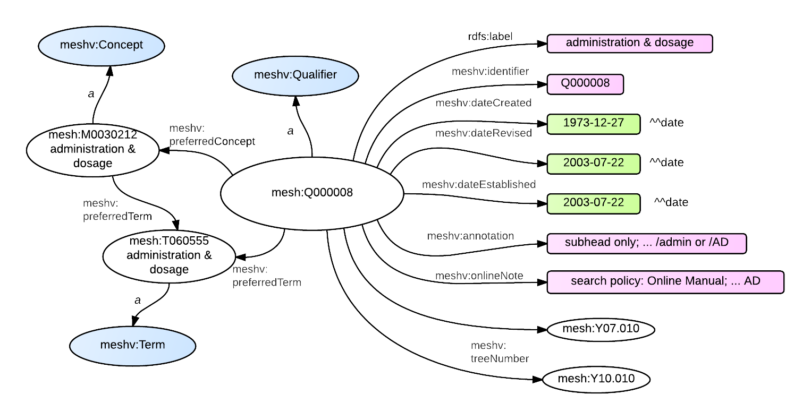

A Qualifier (also known as a Subheading) is a class in MeSH RDF with the name [meshv:Qualifier](http://id.nlm.nih.gov/mesh/vocab#Qualifier){: target="_blank"}.
Qualifiers are used to give additional context to a Descriptor.  MeSH has rules governing which Qualifiers can be used with a given Descriptor, as well as
which Qualifers cannot be used with a given Descriptor.  MeSH RDF has minted Descriptor-Qualifier Pair URIs for both Allowed and Disallowed [Descriptor-Qualifier Pairs](http://hhs.github.io/meshrdf/descriptor-qualifier-pairs.html).
Qualifiers each have tree numbers and are [hierarchically arranged](http://www.nlm.nih.gov/mesh/subhierarchy.html){: target="_blank"}.

### RDF Graph Diagram

{: class="rdf-graph img-responsive"}

### meshv:Qualifier - Relations and Properties

{::options parse_block_html="true" /}

{: #tabs}
<div>

*  [Relations to other classes (as subject)](#tabs-1)
*  [Relations to other classes (as object)](#tabs-2)
*  [meshv:Qualifier properties](#tabs-3)

{: #tabs-1}
<div>

{:.data-table-long .row-border .hover }
Subject | Predicate | Object
------- | --------- | -------
meshv:Qualifier | meshv:broaderQualifier | meshv:Qualifier
meshv:Qualifier | meshv:concept | meshv:Concept
meshv:Qualifier | meshv:preferredConcept | meshv:Concept
meshv:Qualifier | meshv:preferredTerm | meshv:Term
meshv:Qualifier | meshv:treeNumber | meshv:TreeNumber

</div>

{: #tabs-2}
<div>

{:.data-table-long .row-border .hover}
Subject | Predicate | Object
------- | --------- | -------
meshv:AllowedDescriptorQualifierPair | meshv:hasQualifier | meshv:Qualifier
meshv:DescriptorQualifierPair | meshv:hasQualifier | meshv:Qualifier
meshv:DisallowedDescriptorQualifierPair | meshv:hasQualifier | meshv:Qualifier
meshv:GeographicalDescriptor | meshv:allowableQualifier | meshv:Qualifier
meshv:Qualifier | meshv:broaderQualifier | meshv:Qualifier
meshv:TopicalDescriptor | meshv:allowableQualifier | meshv:Qualifier

</div>

{: #tabs-3}
<div>
{:.data-table-long .row-border .hover}
Subject | Predicate
------- | ---------
meshv:Qualifier | meshv:active
meshv:Qualifier | meshv:annotation
meshv:Qualifier | meshv:dateCreated
meshv:Qualifier | meshv:dateEstablished
meshv:Qualifier | meshv:dateRevised
meshv:Qualifier | meshv:historyNote
meshv:Qualifier | meshv:identifier
meshv:Qualifier | meshv:lastActiveYear
meshv:Qualifier | meshv:onlineNote
meshv:Qualifier | rdfs:label

</div>
</div>

### SPARQL

The RDF output shown in the diagram above can be generated with the following
<span class='invoke-sparql'>SPARQL query</span>:


```sparql
prefix mesh: <http://id.nlm.nih.gov/mesh/>
prefix meshv: <http://id.nlm.nih.gov/mesh/vocab#>
construct {
    mesh:Q000008 ?p ?o .
    mesh:Q000008 meshv:preferredConcept ?prefCon .
    ?prefCon a ?prefConType .
    mesh:Q000008 meshv:preferredTerm ?prefTerm .
    ?prefTerm a ?prefTermType .
    ?prefCon ?pct ?prefTerm .
}
from <http://id.nlm.nih.gov/mesh>
where {
    mesh:Q000008 ?p ?o .
    mesh:Q000008 meshv:preferredConcept ?prefCon .
    ?prefCon a ?prefConType .
    mesh:Q000008 meshv:preferredTerm ?prefTerm .
    ?prefTerm a ?prefTermType .
    ?prefCon ?pct ?prefTerm .
}
```