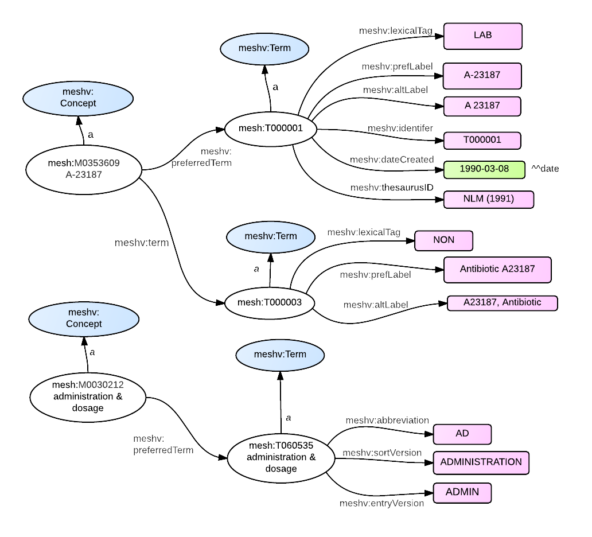

A term is a human readable name used by a MeSH Concept.  Within a MeSH concept, terms are strictly synonymous. In MeSH RDF, terms are members of the  class meshv:Term.
Terms in MeSH often have lexical permutations, such as 'Abnormality, Congenital' as opposed to ['Congenital Abnormalities'](http://id.nlm.nih.gov/mesh/T000029.html).
In MeSH RDF, terms have a property of 'prefLabel' and 'altLabel' to describe this lexical difference.


{: .jump}
&#91; jump to [term properties](#properties) or [term relations](#relations) &#93;

### <a name = "properties"/>RDF Graph Model - Term Properties

{: class="rdf-graph img-responsive"}


### SPARQL - Term Properties

The following <span class='invoke-sparql'>SPARQL query</span> produces the graphs depicted in the
figures above:

```sparql
PREFIX rdfs: <http://www.w3.org/2000/01/rdf-schema#>
PREFIX mesh: <http://id.nlm.nih.gov/mesh/>
PREFIX meshv: <http://id.nlm.nih.gov/mesh/vocab#>

construct {
    mesh:M0353609 rdfs:label ?con1Label .
    mesh:M0353609 a ?con1Class .

    mesh:M0353609 meshv:preferredTerm ?con1PrefTerm .
    ?con1PrefTerm a ?con1PrefTermClass .
    ?con1PrefTerm ?con1PrefTerm_p ?con1PrefTerm_o .

    mesh:M0353609 meshv:term ?con1Term .
    ?con1Term a ?con1TermClass .
    ?con1Term ?con1Term_p ?con1Term_o .

    mesh:M0030212 rdfs:label ?con2Label .
    mesh:M0030212 a ?con2Class .
    mesh:M0030212 meshv:preferredTerm ?con2PrefTerm .
    ?con2PrefTerm a ?con2PrefTermClass .
    ?con2PrefTerm ?con2PrefTerm_p ?con2PrefTerm_o .
}
FROM <http://id.nlm.nih.gov/mesh>
where {
    mesh:M0353609 rdfs:label ?con1Label .
    mesh:M0353609 a ?con1Class .

    mesh:M0353609 meshv:preferredTerm ?con1PrefTerm .
    ?con1PrefTerm a ?con1PrefTermClass .
    ?con1PrefTerm ?con1PrefTerm_p ?con1PrefTerm_o .

    mesh:M0353609 meshv:term ?con1Term .
    ?con1Term a ?con1TermClass .
    ?con1Term ?con1Term_p ?con1Term_o .

    mesh:M0030212 rdfs:label ?con2Label .
    mesh:M0030212 a ?con2Class .
    mesh:M0030212 meshv:preferredTerm ?con2PrefTerm .
    ?con2PrefTerm a ?con2PrefTermClass .
    ?con2PrefTerm ?con2PrefTerm_p ?con2PrefTerm_o .
}
```

### meshv:Term - Relations and Properties

{::options parse_block_html="true" /}

{: #tabs}
<div>

*  [Relations to other classes (as subject)](#tabs-1)
*  [Relations to other classes (as object)](#tabs-2)
*  [meshv:Term properties](#tabs-3)

{: #tabs-1}
<div>

{:.data-table-long .row-border .hover }
Subject | Predicate | Object
------- | --------- | -------
N/A | N/A | N/A 

</div>

{: #tabs-2}
<div>

{:.data-table-long .row-border .hover}
Subject | Predicate | Object
------- | --------- | -------
meshv:CheckTag | meshv:preferredTerm | meshv:Term
meshv:Concept | meshv:preferredTerm | meshv:Term
meshv:Concept | meshv:term | meshv:Term
meshv:Descriptor | meshv:preferredTerm | meshv:Term
meshv:GeographicalDescriptor | meshv:preferredTerm | meshv:Term
meshv:PublicationType | meshv:preferredTerm | meshv:Term
meshv:Qualifier | meshv:preferredTerm | meshv:Term
meshv:SCR_Chemical | meshv:preferredTerm | meshv:Term
meshv:SCR_Disease | meshv:preferredTerm | meshv:Term
meshv:SCR_Protocol | meshv:preferredTerm | meshv:Term
meshv:SupplementaryConceptRecord | meshv:preferredTerm | meshv:Term
meshv:TopicalDescriptor | meshv:preferredTerm | meshv:Term

</div>

{: #tabs-3}
<div>
{:.data-table-long .row-border .hover}
Subject | Predicate
------- | ---------
meshv:Term | meshv:abbreviation
meshv:Term | meshv:altLabel
meshv:Term | meshv:dateCreated
meshv:Term | meshv:entryVersion
meshv:Term | meshv:identifier
meshv:Term | meshv:lexicalTag
meshv:Term | meshv:prefLabel
meshv:Term | meshv:sortVersion
meshv:Term | meshv:thesaurusID
meshv:Term | rdfs:label

</div>
</div>

### <a name = "relations"/>RDF Graph Model - Term Relations

Depicted in these graphs:

{: class="rdf-graph img-responsive"}

### SPARQL - Term Relations

[Note that the following should be possible using the short `CONSTRUCT WHERE` form,
as described in [the SPARQL specification](http://www.w3.org/TR/2013/REC-sparql11-query-20130321/#constructWhere),
but it seems that Virtuoso doesn't support it.]

The following <span class='invoke-sparql'>SPARQL query</span> produces the graphs depicted in the
figures above:

```sparql
PREFIX rdfs: <http://www.w3.org/2000/01/rdf-schema#>
PREFIX mesh: <http://id.nlm.nih.gov/mesh/>
PREFIX meshv: <http://id.nlm.nih.gov/mesh/vocab#>

construct {
    mesh:D000001 a ?descClass .
    ?descClass rdfs:subClassOf ?superClass .

    mesh:D000001 meshv:preferredConcept ?prefCon .
    ?prefCon a ?prefConClass .

    mesh:D000001 meshv:preferredTerm ?prefTerm .
    ?prefCon meshv:preferredTerm ?prefTerm .
    ?prefTerm a ?prefTermClass .

    mesh:D000001 meshv:concept ?con .
    ?con a ?conClass .
    ?con meshv:preferredTerm ?conPrefTerm .
    ?conPrefTerm a ?conPrefTermClass .

    ?con meshv:term ?conTerm .
    ?conTerm a ?conTermClass .
}
FROM <http://id.nlm.nih.gov/mesh>
FROM <http://id.nlm.nih.gov/mesh/vocab>
where {
    mesh:D000001 a ?descClass .
    ?descClass rdfs:subClassOf ?superClass .

    mesh:D000001 meshv:preferredConcept ?prefCon .
    ?prefCon a ?prefConClass .

    mesh:D000001 meshv:preferredTerm ?prefTerm .
    ?prefCon meshv:preferredTerm ?prefTerm .
    ?prefTerm a ?prefTermClass .

    mesh:D000001 meshv:concept ?con .
    ?con a ?conClass .
    ?con meshv:preferredTerm ?conPrefTerm .
    ?conPrefTerm a ?conPrefTermClass .

    ?con meshv:term ?conTerm .
    ?conTerm a ?conTermClass .
}
```