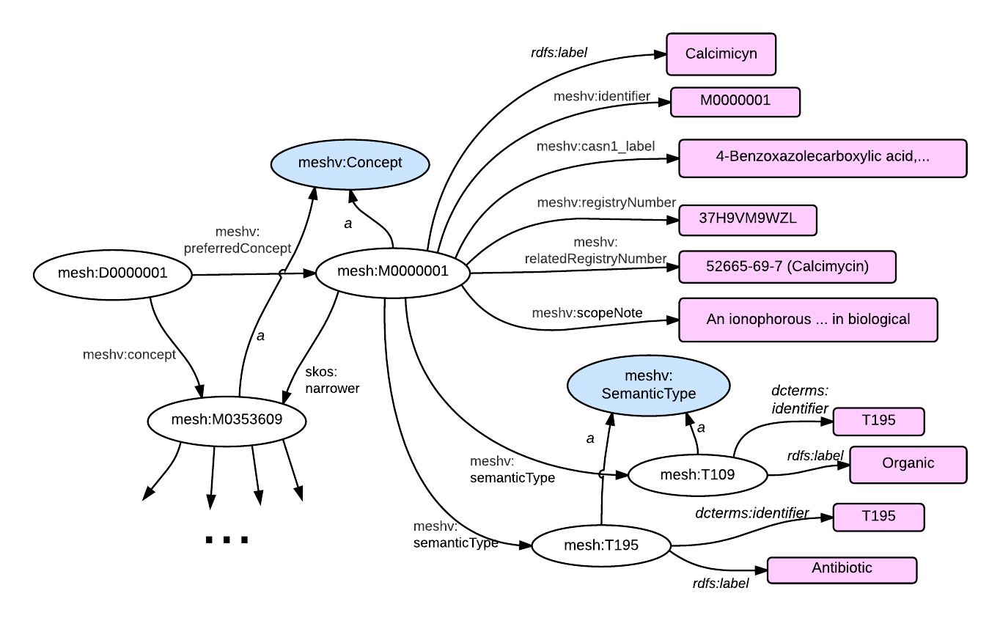

A concept is a class in MeSH RDF (meshv:Concept).  A MeSH Concept represents a unit of meaning.  Collections of concepts that may be useful for search and retrieval on a given topic are placed
into the same MeSH Descriptor.  A concept is considered 'preferred' if its name is used by the descriptor to which it belongs.  All other concepts (if present) are considered
'sub-concepts'.  

## RDF Graph Diagram
{: class="inline-header"}
{: class="rdf-graph"}


## SPARQL
{: class="inline-header"}
The RDF output above can be generated with the following [SPARQL query](http://iddev.nlm.nih.gov/mesh/sparql?query=PREFIX+rdf%3A+%3Chttp%3A%2F%2Fwww.w3.org%2F1999%2F02%2F22-rdf-syntax-ns%23%3E%0D%0APREFIX+rdfs%3A+%3Chttp%3A%2F%2Fwww.w3.org%2F2000%2F01%2Frdf-schema%23%3E%0D%0APREFIX+owl%3A+%3Chttp%3A%2F%2Fwww.w3.org%2F2002%2F07%2Fowl%23%3E%0D%0APREFIX+xsd%3A+%3Chttp%3A%2F%2Fwww.w3.org%2F2001%2FXMLSchema%23%3E%0D%0APREFIX+dc%3A+%3Chttp%3A%2F%2Fpurl.org%2Fdc%2Felements%2F1.1%2F%3E%0D%0APREFIX+dcterms%3A+%3Chttp%3A%2F%2Fpurl.org%2Fdc%2Fterms%2F%3E%0D%0APREFIX+dbpedia2%3A+%3Chttp%3A%2F%2Fdbpedia.org%2Fproperty%2F%3E%0D%0APREFIX+dbpedia%3A+%3Chttp%3A%2F%2Fdbpedia.org%2F%3E%0D%0APREFIX+foaf%3A+%3Chttp%3A%2F%2Fxmlns.com%2Ffoaf%2F0.1%2F%3E%0D%0APREFIX+skos%3A+%3Chttp%3A%2F%2Fwww.w3.org%2F2004%2F02%2Fskos%2Fcore%23%3E%0D%0APREFIX+meshv%3A+%3Chttp%3A%2F%2Fid.nlm.nih.gov%2Fmesh%2Fvocab%23%3E%0D%0APREFIX+mesh%3A+%3Chttp%3A%2F%2Fid.nlm.nih.gov%2Fmesh%2F%3E%0D%0A%0D%0Aconstruct+%7B%0D%0A++++mesh%3AD000001+meshv%3ApreferredConcept+%3Fprefcon+.%0D%0A++++%3Fprefcon+%3Fp+%3Fo+.%0D%0A++++%3Fprefcon+meshv%3AsemanticType+%24semtype+.%0D%0A++++%24semtype+%3Fstp+%24sto+.%0D%0A%7D%0D%0Afrom+%3Chttp%3A%2F%2Fid.nlm.nih.gov%2Fmesh2014%3E%0D%0Awhere+%7B%0D%0A++++mesh%3AD000001+meshv%3ApreferredConcept+%3Fprefcon+.%0D%0A++++%3Fprefcon+%3Fp+%3Fo+.%0D%0A++++%3Fprefcon+meshv%3AsemanticType+%24semtype+.%0D%0A++++%24semtype+%3Fstp+%24sto+.%0D%0A%0D%0A%7D&render=HTML&limit=50&offset=0#lodestart-sparql-results){:target="_blank"}


```sparql
prefix mesh: <http://id.nlm.nih.gov/mesh/>
prefix meshv: <http://id.nlm.nih.gov/mesh/vocab#>

construct {
    mesh:D000001 meshv:preferredConcept ?prefcon .
    ?prefcon ?p ?o .
    ?prefcon meshv:semanticType $semtype .
    $semtype ?stp $sto .
}
from <http://id.nlm.nih.gov/mesh2014>
where {
    mesh:D000001 meshv:preferredConcept ?prefcon .
    ?prefcon ?p ?o .
    ?prefcon meshv:semanticType $semtype .
    $semtype ?stp $sto .

}
```

In [N3](http://iddev.nlm.nih.gov/mesh/servlet/query?query=PREFIX%20rdf%3A%20%3Chttp%3A%2F%2Fwww.w3.org%2F1999%2F02%2F22-rdf-syntax-ns%23%3E%0D%0APREFIX%20rdfs%3A%20%3Chttp%3A%2F%2Fwww.w3.org%2F2000%2F01%2Frdf-schema%23%3E%0D%0APREFIX%20owl%3A%20%3Chttp%3A%2F%2Fwww.w3.org%2F2002%2F07%2Fowl%23%3E%0D%0APREFIX%20xsd%3A%20%3Chttp%3A%2F%2Fwww.w3.org%2F2001%2FXMLSchema%23%3E%0D%0APREFIX%20dc%3A%20%3Chttp%3A%2F%2Fpurl.org%2Fdc%2Felements%2F1.1%2F%3E%0D%0APREFIX%20dcterms%3A%20%3Chttp%3A%2F%2Fpurl.org%2Fdc%2Fterms%2F%3E%0D%0APREFIX%20dbpedia2%3A%20%3Chttp%3A%2F%2Fdbpedia.org%2Fproperty%2F%3E%0D%0APREFIX%20dbpedia%3A%20%3Chttp%3A%2F%2Fdbpedia.org%2F%3E%0D%0APREFIX%20foaf%3A%20%3Chttp%3A%2F%2Fxmlns.com%2Ffoaf%2F0.1%2F%3E%0D%0APREFIX%20skos%3A%20%3Chttp%3A%2F%2Fwww.w3.org%2F2004%2F02%2Fskos%2Fcore%23%3E%0D%0APREFIX%20meshv%3A%20%3Chttp%3A%2F%2Fid.nlm.nih.gov%2Fmesh%2Fvocab%23%3E%0D%0APREFIX%20mesh%3A%20%3Chttp%3A%2F%2Fid.nlm.nih.gov%2Fmesh%2F%3E%0D%0A%0D%0Aconstruct%20%7B%0D%0A%20%20%20%20mesh%3AD000001%20meshv%3ApreferredConcept%20%3Fprefcon%20.%0D%0A%20%20%20%20%3Fprefcon%20%3Fp%20%3Fo%20.%0D%0A%20%20%20%20%3Fprefcon%20meshv%3AsemanticType%20%24semtype%20.%0D%0A%20%20%20%20%24semtype%20%3Fstp%20%24sto%20.%0D%0A%7D%0D%0Afrom%20%3Chttp%3A%2F%2Fid.nlm.nih.gov%2Fmesh2014%3E%0D%0Awhere%20%7B%0D%0A%20%20%20%20mesh%3AD000001%20meshv%3ApreferredConcept%20%3Fprefcon%20.%0D%0A%20%20%20%20%3Fprefcon%20%3Fp%20%3Fo%20.%0D%0A%20%20%20%20%3Fprefcon%20meshv%3AsemanticType%20%24semtype%20.%0D%0A%20%20%20%20%24semtype%20%3Fstp%20%24sto%20.%0D%0A%0D%0A%7D&format=N3){:target="_blank"} format:


```
<http://id.nlm.nih.gov/mesh/T195>
        a       <http://id.nlm.nih.gov/mesh/vocab#SemanticType> ;
        <http://www.w3.org/2000/01/rdf-schema#label>
                "Antibiotic" ;
        <http://purl.org/dc/terms/identifier>
                "T195" .

<http://id.nlm.nih.gov/mesh/D000001>
        <http://id.nlm.nih.gov/mesh/vocab#preferredConcept>
                <http://id.nlm.nih.gov/mesh/M0000001> .

<http://id.nlm.nih.gov/mesh/T109>
        a       <http://id.nlm.nih.gov/mesh/vocab#SemanticType> ;
        <http://www.w3.org/2000/01/rdf-schema#label>
                "Organic Chemical" ;
        <http://purl.org/dc/terms/identifier>
                "T109" .

<http://id.nlm.nih.gov/mesh/M0000001>
        a       <http://id.nlm.nih.gov/mesh/vocab#Concept> ;
        <http://www.w3.org/2000/01/rdf-schema#label>
                "Calcimycin" ;
        <http://id.nlm.nih.gov/mesh/vocab#CASN1_label>
                "4-Benzoxazolecarboxylic acid, 5-(methylamino)-2-((3,9,11-trimethyl-8-(1-methyl-2-oxo-2-(1H-pyrrol-2-yl)ethyl)-1,7-dioxaspiro(5.5)undec-2-yl)methyl)-, (6S-(6alpha(2S*,3S*),8beta(R*),9beta,11alpha))-" ;
        <http://id.nlm.nih.gov/mesh/vocab#preferredTerm>
                <http://id.nlm.nih.gov/mesh/T000002> ;
        <http://id.nlm.nih.gov/mesh/vocab#registryNumber>
                "37H9VM9WZL" ;
        <http://id.nlm.nih.gov/mesh/vocab#relatedRegistryNumber>
                "52665-69-7 (Calcimycin)" ;
        <http://id.nlm.nih.gov/mesh/vocab#semanticType>
                <http://id.nlm.nih.gov/mesh/T195> , <http://id.nlm.nih.gov/mesh/T109> ;
        <http://purl.org/dc/terms/identifier>
                "M0000001" ;
        <http://www.w3.org/2004/02/skos/core#narrower>
                <http://id.nlm.nih.gov/mesh/M0353609> ;
        <http://www.w3.org/2004/02/skos/core#scopeNote>
                "An ionophorous, polyether antibiotic from Streptomyces chartreusensis.
                It binds and transports CALCIUM and other divalent cations across membranes and uncouples oxidative phosphorylation while inhibiting ATPase of rat liver mitochondria.
                The substance is used mostly as a biochemical tool to study the role of divalent cations in various biological systems."

```


Note that this page does not describe Terms, which are subordinate to Concepts, but most other things directly related to Concepts are here.

## MeSH XML
{: class="inline-header"}


```xml
<DescriptorRecord DescriptorClass="1">
  <DescriptorUI>D000001</DescriptorUI>
  <DescriptorName>
    <String>Calcimycin</String>
  </DescriptorName>
  ...
  <ConceptList>
    <Concept PreferredConceptYN="Y">
      <ConceptUI>M0000001</ConceptUI>
      <ConceptName>
        <String>Calcimycin</String>
      </ConceptName>
      <CASN1Name>4-Benzoxazolecarboxylic acid,  ...</CASN1Name>
      <RegistryNumber>37H9VM9WZL</RegistryNumber>
      <ScopeNote>An ionophorous, ... </ScopeNote>
      <SemanticTypeList>
        <SemanticType>
          <SemanticTypeUI>T109</SemanticTypeUI>
          <SemanticTypeName>Organic Chemical</SemanticTypeName>
        </SemanticType>
        <SemanticType>
          <SemanticTypeUI>T195</SemanticTypeUI>
          <SemanticTypeName>Antibiotic</SemanticTypeName>
        </SemanticType>
      </SemanticTypeList>
      <RelatedRegistryNumberList>
        <RelatedRegistryNumber>52665-69-7 (Calcimycin)</RelatedRegistryNumber>
      </RelatedRegistryNumberList>
      <ConceptRelationList>
        <ConceptRelation RelationName="NRW">
          <Concept1UI>M0000001</Concept1UI>
          <Concept2UI>M0353609</Concept2UI>
        </ConceptRelation>
      </ConceptRelationList>
      ...
    </Concept>
    <Concept PreferredConceptYN="N">
      <ConceptUI>M0353609</ConceptUI>
      ...
    </Concept>
  </ConceptList>
</DescriptorRecord>
```

Note:  RelationAttributes (not depicted in this example; see the [MeSH documentation](http://www.nlm.nih.gov/mesh/xml_data_elements.html#RelationAttribute) and [GitHub issue #15](https://github.com/HHS/mesh-rdf/issues/15#issuecomment-50952078)) are currently modeled with their own property URIs.  So, for example, the XML


```
    <ConceptRelation RelationName="REL">
      <Concept1UI>M0000205</Concept1UI>
      <Concept2UI>M0567458</Concept2UI>
      <RelationAttribute>187600</RelationAttribute>
    </ConceptRelation>
```

  would produce two triples:


```
    mesh:M0000205 skos:related mesh:M0567458 .
    mesh:M0000205 mesh:rela/187600 mesh:M0567458 .
```


