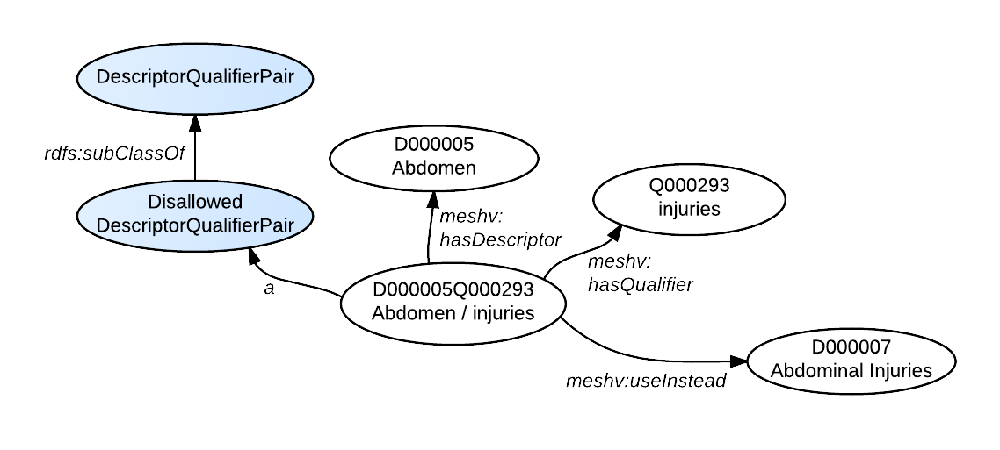

When indexing or cataloging resources using MeSH, NLM pairs Descriptors (main headings) and Qualifiers (sub-headings). Qualifiers comprise a set of 83 terms used to add more specificity to descriptors. Each Descriptor has a set of Allowable Qualifiers. In RDF, Descriptors and Qualifiers may be treated as separate classes, but we have also chosen to create a class of Descriptor-Qualifier pairs, each with its own URI. For example, the pairing of a Descriptor (D015242, Ofloxacin) and one of its Allowable Qualifiers (Q000008, administration &amp; dosage) has the following URI:
[http://id.nlm.nih.gov/mesh/D015242Q000008](http://id.nlm.nih.gov/mesh/D015242Q000008){: target="_blank"}

{: .jump}
&#91; jump to [entry combinations](#entry-combinations) &#93;

### Class Information

In MeSH RDF, the subclasses of meshv:DescriptorQualifierPairs are:

*  meshv:AllowedDescriptorQualifierPair
*  meshv:DisallowedDescriptorQualifierPair

### RDF Graph Diagram

The following RDF graph diagram shows how descriptor-qualifier pairs are modeled. Note that the pairing (D015242Q000008, Ofloxacin/administration &amp; dosage) is an instance of the class, meshv:AllowedDescriptorQualifierPair. Relationships between the descriptor-qualifier pair and its respective descriptor and qualifier are explicitly defined.

{: class="rdf-graph img-responsive"}


### meshv:DescriptorQualifierPairs - Relations and Properties
This table includes all the sub-classes of the meshv:DescriptorQualifierPairs class as either the subject or object of an RDF triple.

{::options parse_block_html="true" /}

{: #tabs}
<div>

*  [Relations to other classes (as subject)](#tabs-1)
*  [Relations to other classes (as object)](#tabs-2)

{: #tabs-1}
<div>

{:.data-table-long .row-border .hover }
Subject | Predicate | Object
------- | --------- | -------
meshv:AllowedDescriptorQualifierPair | meshv:hasDescriptor | meshv:Descriptor
meshv:AllowedDescriptorQualifierPair | meshv:hasDescriptor | meshv:GeographicalDescriptor
meshv:AllowedDescriptorQualifierPair | meshv:hasDescriptor | meshv:TopicalDescriptor
meshv:AllowedDescriptorQualifierPair | meshv:hasQualifier | meshv:Qualifier
meshv:DescriptorQualifierPair | meshv:hasDescriptor | meshv:Descriptor
meshv:DescriptorQualifierPair | meshv:hasDescriptor | meshv:GeographicalDescriptor
meshv:DescriptorQualifierPair | meshv:hasDescriptor | meshv:TopicalDescriptor
meshv:DescriptorQualifierPair | meshv:hasQualifier | meshv:Qualifier
meshv:DescriptorQualifierPair | meshv:useInstead | meshv:AllowedDescriptorQualifierPair
meshv:DescriptorQualifierPair | meshv:useInstead | meshv:Descriptor
meshv:DescriptorQualifierPair | meshv:useInstead | meshv:DescriptorQualifierPair
meshv:DescriptorQualifierPair | meshv:useInstead | meshv:TopicalDescriptor
meshv:DisallowedDescriptorQualifierPair | meshv:hasDescriptor | meshv:Descriptor
meshv:DisallowedDescriptorQualifierPair | meshv:hasDescriptor | meshv:TopicalDescriptor
meshv:DisallowedDescriptorQualifierPair | meshv:hasQualifier | meshv:Qualifier
meshv:DisallowedDescriptorQualifierPair | meshv:useInstead | meshv:AllowedDescriptorQualifierPair
meshv:DisallowedDescriptorQualifierPair | meshv:useInstead | meshv:Descriptor
meshv:DisallowedDescriptorQualifierPair | meshv:useInstead | meshv:DescriptorQualifierPair
meshv:DisallowedDescriptorQualifierPair | meshv:useInstead | meshv:TopicalDescriptor

</div>

{: #tabs-2}
<div>

{:.data-table-long .row-border .hover }
Subject | Predicate | Object
------- | --------- | -------
meshv:DescriptorQualifierPair | meshv:useInstead | meshv:AllowedDescriptorQualifierPair
meshv:DescriptorQualifierPair | meshv:useInstead | meshv:DescriptorQualifierPair
meshv:DisallowedDescriptorQualifierPair | meshv:useInstead | meshv:AllowedDescriptorQualifierPair
meshv:DisallowedDescriptorQualifierPair | meshv:useInstead | meshv:DescriptorQualifierPair
meshv:SCR_Chemical | meshv:indexerConsiderAlso | meshv:AllowedDescriptorQualifierPair
meshv:SCR_Chemical | meshv:indexerConsiderAlso | meshv:DescriptorQualifierPair
meshv:SCR_Chemical | meshv:indexerConsiderAlso | meshv:DisallowedDescriptorQualifierPair
meshv:SCR_Chemical | meshv:preferredMappedTo | meshv:AllowedDescriptorQualifierPair
meshv:SCR_Chemical | meshv:preferredMappedTo | meshv:DescriptorQualifierPair
meshv:SCR_Disease | meshv:mappedTo | meshv:AllowedDescriptorQualifierPair
meshv:SCR_Disease | meshv:mappedTo | meshv:DescriptorQualifierPair
meshv:SCR_Disease | meshv:preferredMappedTo | meshv:AllowedDescriptorQualifierPair
meshv:SCR_Disease | meshv:preferredMappedTo | meshv:DescriptorQualifierPair
meshv:SCR_Protocol | meshv:preferredMappedTo | meshv:AllowedDescriptorQualifierPair
meshv:SCR_Protocol | meshv:preferredMappedTo | meshv:DescriptorQualifierPair
meshv:SupplementaryConceptRecord | meshv:indexerConsiderAlso | meshv:AllowedDescriptorQualifierPair
meshv:SupplementaryConceptRecord | meshv:indexerConsiderAlso | meshv:DescriptorQualifierPair
meshv:SupplementaryConceptRecord | meshv:indexerConsiderAlso | meshv:DisallowedDescriptorQualifierPair
meshv:SupplementaryConceptRecord | meshv:mappedTo | meshv:AllowedDescriptorQualifierPair
meshv:SupplementaryConceptRecord | meshv:mappedTo | meshv:DescriptorQualifierPair
meshv:SupplementaryConceptRecord | meshv:preferredMappedTo | meshv:AllowedDescriptorQualifierPair
meshv:SupplementaryConceptRecord | meshv:preferredMappedTo | meshv:DescriptorQualifierPair

</div>
</div>

### SPARQL

The following <span class='invoke-sparql'>SPARQL query</span> will produce the the data shown in the RDF graph diagram above.


```sparql
PREFIX rdf: <http://www.w3.org/1999/02/22-rdf-syntax-ns#>
PREFIX rdfs: <http://www.w3.org/2000/01/rdf-schema#>
PREFIX mesh: <http://id.nlm.nih.gov/mesh/>
PREFIX meshv: <http://id.nlm.nih.gov/mesh/vocab#>

construct {
    ?dqpair meshv:hasDescriptor mesh:D015242 .
    ?dqpair meshv:hasQualifier mesh:Q000008 .
    mesh:D015242 meshv:allowableQualifier mesh:Q000008 .
    ?dqpair rdf:type ?dqclass .
    ?dqclass rdfs:subClassOf ?superclass .
}
from <http://id.nlm.nih.gov/mesh>
from <http://id.nlm.nih.gov/mesh/vocab>
where {
    ?dqpair meshv:hasDescriptor mesh:D015242 .
    ?dqpair meshv:hasQualifier mesh:Q000008 .
    mesh:D015242 meshv:allowableQualifier mesh:Q000008 .
    ?dqpair rdf:type ?dqclass .
    ?dqclass rdfs:subClassOf ?superclass .
}
```

The following shows how EntryCombinations (see the [MeSH documentation](http://www.nlm.nih.gov/mesh/xml_data_elements.html#EntryCombination)) are modeled.

### <a name = "entry-combinations"/>RDF Graph Diagram

Depicted in this graph:

{: class="rdf-graph img-responsive"}

### SPARQL

The following <span class='invoke-sparql'>SPARQL query</span> produces the RDF corresponding
to the above graph:

```sparql
PREFIX rdf: <http://www.w3.org/1999/02/22-rdf-syntax-ns#>
PREFIX rdfs: <http://www.w3.org/2000/01/rdf-schema#>
PREFIX mesh: <http://id.nlm.nih.gov/mesh/>
PREFIX meshv: <http://id.nlm.nih.gov/mesh/vocab#>

CONSTRUCT {
  ?ecin ?p ?o .
  ?ecin rdf:type ?eclass .
  ?eclass rdfs:subClassOf $superclass .
}
from <http://id.nlm.nih.gov/mesh>
from <http://id.nlm.nih.gov/mesh/vocab>
where {
  ?ecin meshv:hasDescriptor mesh:D000005 .
  ?ecin meshv:hasQualifier ?ecinq .
  ?ecin meshv:useInstead ?ecout .
  ?ecin ?p ?o .
  ?ecin rdf:type ?eclass .
  ?eclass rdfs:subClassOf $superclass .
}
```