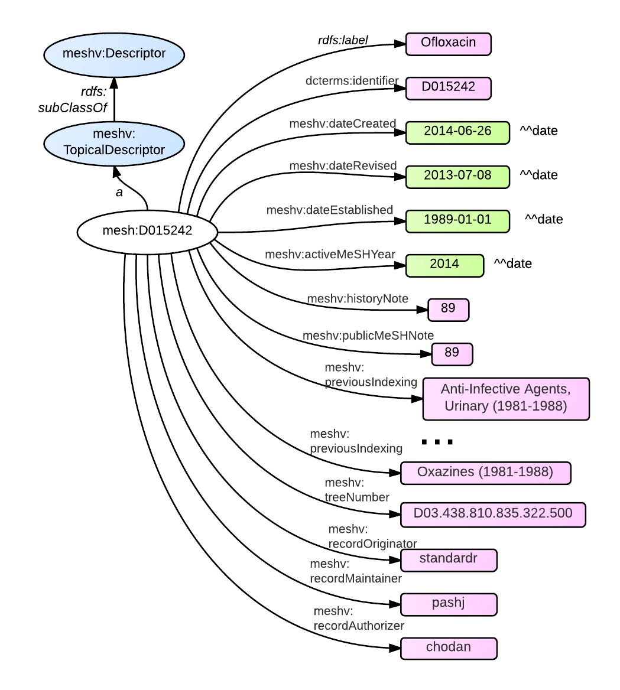
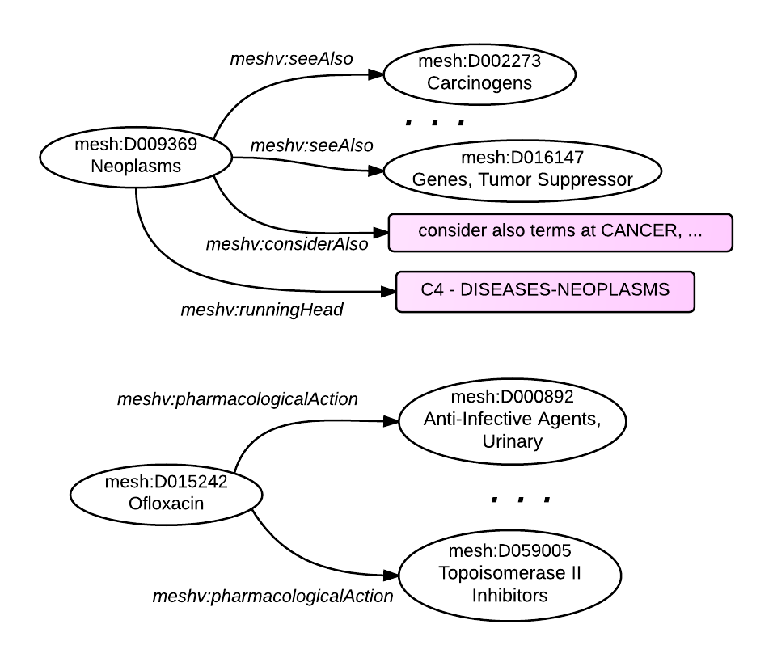

A Descriptor is a class in MeSH RDF with the name [meshv:Descriptor](http://id.nlm.nih.gov/mesh/describe?uri=http%3A%2F%2Fid.nlm.nih.gov%2Fmesh%2Fvocab%23Descriptor){:target="_blank"}.
Also known as Main Headings or MeSH Headings, Descriptors are used to index citations in the NLM MEDLINE database and to describe the subjects for NLM Catalog records.
Descriptors are searchable in PubMed and NLM Catalog with the search tag [MH]. Most Descriptors indicate the subject of a resource (including geographic terms).
Some indicate publication types (what a resource is rather than what it is about; for example: Randomized Controlled Trial or Letter).
For more information about Descriptors, visit the NLM [MeSH Record Types page](http://www.nlm.nih.gov/mesh/intro_record_types.html).

{: .jump}
&#91; jump to [descriptor properties](#properties) or [descriptor relations](#relations) &#93;


### Class Information

In MeSH RDF, the subclasses of meshv:Descriptor are:

*  meshv:TopicalDescriptor
*  meshv:PublicationType
*  meshv:CheckTag
*  meshv:GeographicalDescriptor


The chart below displays the properties of the meshv:TopicalDescriptor D015242, 'Ofloxacin'.

###<a name = "properties"/>RDF Graph Diagram - Descriptor Properties

The following RDF graph diagram shows a fairly typical topical descriptor (D015242, Ofloxacin) and its literals. For reference, see [Ofloxacin in the MeSH browser](https://www.nlm.nih.gov/cgi/mesh/2014/MB_cgi?term=ofloxacin). The data elements featured here have literal strings as objects, not identifiers.

{: class="rdf-graph img-responsive"}

###SPARQL - Descriptor Properties

The following <span class='invoke-sparql'>SPARQL query</span> will produce the predicates and objects of Ofloxacin.


```sparql
PREFIX mesh: <http://id.nlm.nih.gov/mesh/>
CONSTRUCT { mesh:D015242 ?p ?o . }
FROM <http://id.nlm.nih.gov/mesh2014>
WHERE {
  mesh:D015242 ?p ?o .
}
```

###MeSH RDF Data - Descriptor Properties

Here is the truncated output of the above query in N3 format. The same data is illustrated in the RDF graph diagram above.

```
<http://id.nlm.nih.gov/mesh/D015242>
        a       <http://id.nlm.nih.gov/mesh/vocab#TopicalDescriptor> ;
        <http://www.w3.org/2000/01/rdf-schema#label>
                "Ofloxacin" ;
        <http://id.nlm.nih.gov/mesh/vocab#activeMeSHYear>
                "2014-01-01"^^<http://www.w3.org/2001/XMLSchema#date> ;
                ...
        <http://id.nlm.nih.gov/mesh/vocab#dateCreated>
                "2014-06-26"^^<http://www.w3.org/2001/XMLSchema#date> ;
        <http://id.nlm.nih.gov/mesh/vocab#dateEstablished>
                "1989-01-01"^^<http://www.w3.org/2001/XMLSchema#date> ;
        <http://id.nlm.nih.gov/mesh/vocab#dateRevised>
                "2013-07-08"^^<http://www.w3.org/2001/XMLSchema#date> ;
        <http://id.nlm.nih.gov/mesh/vocab#historyNote>
                "89" ;
                ...
        <http://id.nlm.nih.gov/mesh/vocab#previousIndexing>
                "Anti-Infective Agents, Urinary (1981-1988)" ,
                ...
                "Oxazines (1981-1988)" ;
        <http://id.nlm.nih.gov/mesh/vocab#publicMeSHNote>
                "89" ;
        <http://id.nlm.nih.gov/mesh/vocab#recordAuthorizer>
                "chodan" ;
        <http://id.nlm.nih.gov/mesh/vocab#recordMaintainer>
                "pashj" ;
        <http://id.nlm.nih.gov/mesh/vocab#recordOriginator>
                "standardr" ;
        <http://id.nlm.nih.gov/mesh/vocab#recordPreferredTerm>
                <http://id.nlm.nih.gov/mesh/T044624> ;
                ...
        <http://purl.org/dc/terms/identifier>
                "D015242" ;
                ...
```

###MeSH XML - Descriptor Properties

The MeSH RDF was derived from non-RDF MeSH XML. Compare the RDF graph diagram and the N3 data above to the truncated MeSH XML for Ofloxacin below.


```xml
<DescriptorRecord DescriptorClass = "1">
  <DescriptorUI>D015242</DescriptorUI>
  <DescriptorName>
   <String>Ofloxacin</String>
  </DescriptorName>
  <DateCreated>
   <Year>2014</Year>
   <Month>06</Month>
   <Day>26</Day>
  </DateCreated>
  <DateRevised>
   <Year>2013</Year>
   <Month>07</Month>
   <Day>08</Day>
  </DateRevised>
  <DateEstablished>
   <Year>1989</Year>
   <Month>01</Month>
   <Day>01</Day>
  </DateEstablished>
  <ActiveMeSHYearList>
   <Year>2014</Year>
  </ActiveMeSHYearList>
  ...
  <HistoryNote>89
  </HistoryNote>
  <PublicMeSHNote>89
  </PublicMeSHNote>
  <PreviousIndexingList>
   ...
   <PreviousIndexing>Anti-Infective Agents, Urinary (1981-1988)</PreviousIndexing>
   <PreviousIndexing>Oxazines (1981-1988)</PreviousIndexing>
  </PreviousIndexingList>
  ...
  <RecordOriginatorsList>
   <RecordOriginator>standardr</RecordOriginator>
   <RecordMaintainer>pashj</RecordMaintainer>
   <RecordAuthorizer>chodan</RecordAuthorizer>
  </RecordOriginatorsList>
  ...
 </DescriptorRecord>
```

### meshv:Descriptor - Relations and Properties
This table includes all the sub-classes of the meshv:Descriptor class as either the subject or object of an RDF triple, as well properties of the class.

{::options parse_block_html="true" /}

{: #tabs}
<div>

*  [Relations to other classes (as subject)](#tabs-1)
*  [Relations to other classes (as object)](#tabs-2)
*  [meshv:Descriptor properties](#tabs-3)

{: #tabs-1}
<div>

{:.data-table-long .row-border .hover}
Subject | Predicate | Object
------- | --------- | --------
meshv:CheckTag | meshv:preferredConcept | meshv:Concept
meshv:CheckTag | meshv:recordPreferredTerm | meshv:Term
meshv:Descriptor | meshv:allowableQualifier | meshv:Qualifier
meshv:Descriptor | meshv:broader | meshv:Descriptor
meshv:Descriptor | meshv:broader | meshv:GeographicalDescriptor
meshv:Descriptor | meshv:broader | meshv:PublicationType
meshv:Descriptor | meshv:broader | meshv:TopicalDescriptor
meshv:Descriptor | meshv:concept | meshv:Concept
meshv:Descriptor | meshv:pharmacologicalAction | meshv:Descriptor
meshv:Descriptor | meshv:pharmacologicalAction | meshv:TopicalDescriptor
meshv:Descriptor | meshv:preferredConcept | meshv:Concept
meshv:Descriptor | meshv:recordPreferredTerm | meshv:Term
meshv:Descriptor | meshv:seeAlso | meshv:Descriptor
meshv:Descriptor | meshv:seeAlso | meshv:PublicationType
meshv:Descriptor | meshv:seeAlso | meshv:TopicalDescriptor
meshv:Descriptor | meshv:treeNumber | meshv:TreeNumber
meshv:GeographicalDescriptor | meshv:allowableQualifier | meshv:Qualifier
meshv:GeographicalDescriptor | meshv:broader | meshv:Descriptor
meshv:GeographicalDescriptor | meshv:broader | meshv:GeographicalDescriptor
meshv:GeographicalDescriptor | meshv:broader | meshv:TopicalDescriptor
meshv:GeographicalDescriptor | meshv:concept | meshv:Concept
meshv:GeographicalDescriptor | meshv:preferredConcept | meshv:Concept
meshv:GeographicalDescriptor | meshv:recordPreferredTerm | meshv:Term
meshv:GeographicalDescriptor | meshv:treeNumber | meshv:TreeNumber
meshv:PublicationType | meshv:broader | meshv:Descriptor
meshv:PublicationType | meshv:broader | meshv:PublicationType
meshv:PublicationType | meshv:concept | meshv:Concept
meshv:PublicationType | meshv:preferredConcept | meshv:Concept
meshv:PublicationType | meshv:recordPreferredTerm | meshv:Term
meshv:PublicationType | meshv:seeAlso | meshv:Descriptor
meshv:PublicationType | meshv:seeAlso | meshv:PublicationType
meshv:PublicationType | meshv:treeNumber | meshv:TreeNumber
meshv:TopicalDescriptor | meshv:allowableQualifier | meshv:Qualifier
meshv:TopicalDescriptor | meshv:broader | meshv:Descriptor
meshv:TopicalDescriptor | meshv:broader | meshv:TopicalDescriptor
meshv:TopicalDescriptor | meshv:concept | meshv:Concept
meshv:TopicalDescriptor | meshv:pharmacologicalAction | meshv:Descriptor
meshv:TopicalDescriptor | meshv:pharmacologicalAction | meshv:TopicalDescriptor
meshv:TopicalDescriptor | meshv:preferredConcept | meshv:Concept
meshv:TopicalDescriptor | meshv:recordPreferredTerm | meshv:Term
meshv:TopicalDescriptor | meshv:seeAlso | meshv:Descriptor
meshv:TopicalDescriptor | meshv:seeAlso | meshv:PublicationType
meshv:TopicalDescriptor | meshv:seeAlso | meshv:TopicalDescriptor
meshv:TopicalDescriptor | meshv:treeNumber | meshv:TreeNumber

</div>

{: #tabs-2}
<div>

{:.data-table-long .row-border .hover}
Subject | Predicate | Object
------- | --------- | --------
meshv:AllowedDescriptorQualifierPair | meshv:hasDescriptor | meshv:Descriptor
meshv:AllowedDescriptorQualifierPair | meshv:hasDescriptor | meshv:GeographicalDescriptor
meshv:AllowedDescriptorQualifierPair | meshv:hasDescriptor | meshv:TopicalDescriptor
meshv:Descriptor | meshv:broader | meshv:Descriptor
meshv:Descriptor | meshv:broader | meshv:GeographicalDescriptor
meshv:Descriptor | meshv:broader | meshv:PublicationType
meshv:Descriptor | meshv:broader | meshv:TopicalDescriptor
meshv:Descriptor | meshv:pharmacologicalAction | meshv:Descriptor
meshv:Descriptor | meshv:pharmacologicalAction | meshv:TopicalDescriptor
meshv:Descriptor | meshv:seeAlso | meshv:Descriptor
meshv:Descriptor | meshv:seeAlso | meshv:PublicationType
meshv:Descriptor | meshv:seeAlso | meshv:TopicalDescriptor
meshv:DescriptorQualifierPair | meshv:hasDescriptor | meshv:Descriptor
meshv:DescriptorQualifierPair | meshv:hasDescriptor | meshv:GeographicalDescriptor
meshv:DescriptorQualifierPair | meshv:hasDescriptor | meshv:TopicalDescriptor
meshv:DescriptorQualifierPair | meshv:useInstead | meshv:Descriptor
meshv:DescriptorQualifierPair | meshv:useInstead | meshv:TopicalDescriptor
meshv:DisallowedDescriptorQualifierPair | meshv:hasDescriptor | meshv:Descriptor
meshv:DisallowedDescriptorQualifierPair | meshv:hasDescriptor | meshv:TopicalDescriptor
meshv:DisallowedDescriptorQualifierPair | meshv:useInstead | meshv:Descriptor
meshv:DisallowedDescriptorQualifierPair | meshv:useInstead | meshv:TopicalDescriptor
meshv:GeographicalDescriptor | meshv:broader | meshv:Descriptor
meshv:GeographicalDescriptor | meshv:broader | meshv:GeographicalDescriptor
meshv:GeographicalDescriptor | meshv:broader | meshv:TopicalDescriptor
meshv:PublicationType | meshv:broader | meshv:Descriptor
meshv:PublicationType | meshv:broader | meshv:PublicationType
meshv:PublicationType | meshv:seeAlso | meshv:Descriptor
meshv:PublicationType | meshv:seeAlso | meshv:PublicationType
meshv:SCR_Chemical | meshv:indexerConsiderAlso | meshv:Descriptor
meshv:SCR_Chemical | meshv:indexerConsiderAlso | meshv:TopicalDescriptor
meshv:SCR_Chemical | meshv:mappedTo | meshv:Descriptor
meshv:SCR_Chemical | meshv:mappedTo | meshv:TopicalDescriptor
meshv:SCR_Chemical | meshv:pharmacologicalAction | meshv:Descriptor
meshv:SCR_Chemical | meshv:pharmacologicalAction | meshv:TopicalDescriptor
meshv:SCR_Chemical | meshv:preferredMappedTo | meshv:Descriptor
meshv:SCR_Chemical | meshv:preferredMappedTo | meshv:TopicalDescriptor
meshv:SCR_Disease | meshv:indexerConsiderAlso | meshv:Descriptor
meshv:SCR_Disease | meshv:indexerConsiderAlso | meshv:TopicalDescriptor
meshv:SCR_Disease | meshv:mappedTo | meshv:Descriptor
meshv:SCR_Disease | meshv:mappedTo | meshv:TopicalDescriptor
meshv:SCR_Disease | meshv:preferredMappedTo | meshv:Descriptor
meshv:SCR_Disease | meshv:preferredMappedTo | meshv:TopicalDescriptor
meshv:SCR_Protocol | meshv:indexerConsiderAlso | meshv:Descriptor
meshv:SCR_Protocol | meshv:indexerConsiderAlso | meshv:TopicalDescriptor
meshv:SCR_Protocol | meshv:mappedTo | meshv:Descriptor
meshv:SCR_Protocol | meshv:mappedTo | meshv:TopicalDescriptor
meshv:SCR_Protocol | meshv:pharmacologicalAction | meshv:Descriptor
meshv:SCR_Protocol | meshv:pharmacologicalAction | meshv:TopicalDescriptor
meshv:SCR_Protocol | meshv:preferredMappedTo | meshv:Descriptor
meshv:SCR_Protocol | meshv:preferredMappedTo | meshv:TopicalDescriptor
meshv:SupplementaryConceptRecord | meshv:indexerConsiderAlso | meshv:Descriptor
meshv:SupplementaryConceptRecord | meshv:indexerConsiderAlso | meshv:TopicalDescriptor
meshv:SupplementaryConceptRecord | meshv:mappedTo | meshv:Descriptor
meshv:SupplementaryConceptRecord | meshv:mappedTo | meshv:TopicalDescriptor
meshv:SupplementaryConceptRecord | meshv:pharmacologicalAction | meshv:Descriptor
meshv:SupplementaryConceptRecord | meshv:pharmacologicalAction | meshv:TopicalDescriptor
meshv:SupplementaryConceptRecord | meshv:preferredMappedTo | meshv:Descriptor
meshv:SupplementaryConceptRecord | meshv:preferredMappedTo | meshv:TopicalDescriptor
meshv:TopicalDescriptor | meshv:broader | meshv:Descriptor
meshv:TopicalDescriptor | meshv:broader | meshv:TopicalDescriptor
meshv:TopicalDescriptor | meshv:pharmacologicalAction | meshv:Descriptor
meshv:TopicalDescriptor | meshv:pharmacologicalAction | meshv:TopicalDescriptor
meshv:TopicalDescriptor | meshv:seeAlso | meshv:Descriptor
meshv:TopicalDescriptor | meshv:seeAlso | meshv:PublicationType
meshv:TopicalDescriptor | meshv:seeAlso | meshv:TopicalDescriptor

</div>

{: #tabs-3}
<div>
{:.data-table-long .row-border .hover}
Subject | Predicate
------- | ---------
meshv:CheckTag | meshv:activeMeSHYear
meshv:CheckTag | meshv:annotation
meshv:CheckTag | meshv:dateCreated
meshv:CheckTag | meshv:dateRevised
meshv:CheckTag | meshv:historyNote
meshv:CheckTag | meshv:identifier
meshv:CheckTag | meshv:recordAuthorizer
meshv:CheckTag | meshv:recordMaintainer
meshv:CheckTag | meshv:recordOriginator
meshv:CheckTag | rdfs:label
meshv:Descriptor | meshv:activeMeSHYear
meshv:Descriptor | meshv:annotation
meshv:Descriptor | meshv:considerAlso
meshv:Descriptor | meshv:dateCreated
meshv:Descriptor | meshv:dateEstablished
meshv:Descriptor | meshv:dateRevised
meshv:Descriptor | meshv:historyNote
meshv:Descriptor | meshv:identifier
meshv:Descriptor | meshv:onlineNote
meshv:Descriptor | meshv:previousIndexing
meshv:Descriptor | meshv:publicMeSHNote
meshv:Descriptor | meshv:recordAuthorizer
meshv:Descriptor | meshv:recordMaintainer
meshv:Descriptor | meshv:recordOriginator
meshv:Descriptor | meshv:runningHead
meshv:Descriptor | rdfs:label
meshv:GeographicalDescriptor | meshv:activeMeSHYear
meshv:GeographicalDescriptor | meshv:annotation
meshv:GeographicalDescriptor | meshv:dateCreated
meshv:GeographicalDescriptor | meshv:dateEstablished
meshv:GeographicalDescriptor | meshv:dateRevised
meshv:GeographicalDescriptor | meshv:historyNote
meshv:GeographicalDescriptor | meshv:identifier
meshv:GeographicalDescriptor | meshv:onlineNote
meshv:GeographicalDescriptor | meshv:previousIndexing
meshv:GeographicalDescriptor | meshv:recordAuthorizer
meshv:GeographicalDescriptor | meshv:recordMaintainer
meshv:GeographicalDescriptor | meshv:recordOriginator
meshv:GeographicalDescriptor | meshv:runningHead
meshv:GeographicalDescriptor | rdfs:label
meshv:PublicationType | meshv:activeMeSHYear
meshv:PublicationType | meshv:annotation
meshv:PublicationType | meshv:dateCreated
meshv:PublicationType | meshv:dateEstablished
meshv:PublicationType | meshv:dateRevised
meshv:PublicationType | meshv:historyNote
meshv:PublicationType | meshv:identifier
meshv:PublicationType | meshv:previousIndexing
meshv:PublicationType | meshv:recordAuthorizer
meshv:PublicationType | meshv:recordMaintainer
meshv:PublicationType | meshv:recordOriginator
meshv:PublicationType | meshv:runningHead
meshv:PublicationType | rdfs:label
meshv:TopicalDescriptor | meshv:activeMeSHYear
meshv:TopicalDescriptor | meshv:annotation
meshv:TopicalDescriptor | meshv:considerAlso
meshv:TopicalDescriptor | meshv:dateCreated
meshv:TopicalDescriptor | meshv:dateEstablished
meshv:TopicalDescriptor | meshv:dateRevised
meshv:TopicalDescriptor | meshv:historyNote
meshv:TopicalDescriptor | meshv:identifier
meshv:TopicalDescriptor | meshv:onlineNote
meshv:TopicalDescriptor | meshv:previousIndexing
meshv:TopicalDescriptor | meshv:publicMeSHNote
meshv:TopicalDescriptor | meshv:recordAuthorizer
meshv:TopicalDescriptor | meshv:recordMaintainer
meshv:TopicalDescriptor | meshv:recordOriginator
meshv:TopicalDescriptor | meshv:runningHead
meshv:TopicalDescriptor | rdfs:label

</div>
</div>


###<a name = "relations"/>RDF Graph Diagram - Descriptor Relations

The graph below depicts the relations of Ofloxacin to other classes.

{: class="rdf-graph img-responsive"}

###SPARQL - Descriptor Relations

The RDF output above can be generated with the following <span class='invoke-sparql'>SPARQL query</span>.


```sparql
PREFIX mesh: <http://id.nlm.nih.gov/mesh/>
PREFIX meshv: <http://id.nlm.nih.gov/mesh/vocab#>

construct {
    mesh:D009369 meshv:annotation ?a .
    mesh:D009369 meshv:seeAlso ?sa .
    mesh:D009369 meshv:considerAlso ?ca .
    mesh:D009369 meshv:runningHead ?rh .
    mesh:D015242 meshv:pharmacologicalAction ?pa .
}
from <http://id.nlm.nih.gov/mesh2014>
where {
    mesh:D009369 meshv:annotation ?a .
    mesh:D009369 meshv:seeAlso ?sa .
    mesh:D009369 meshv:considerAlso ?ca .
    mesh:D009369 meshv:runningHead ?rh .
    mesh:D015242 meshv:pharmacologicalAction ?pa .
}
```

###MeSH RDF Data - Descriptor Relations

Here is the truncated output of the above query in N3 format. The same data is illustrated in the RDF graph diagram above.

```
<http://id.nlm.nih.gov/mesh/D015242>
        <http://id.nlm.nih.gov/mesh/vocab#pharmacologicalAction>
                <http://id.nlm.nih.gov/mesh/D000892> , 
                ...
                <http://id.nlm.nih.gov/mesh/D059005> .

<http://id.nlm.nih.gov/mesh/D009369>
        <http://id.nlm.nih.gov/mesh/vocab#annotation>
                "general; prefer specifics; policy: Manual section 24; qualifier / nurs = the patient, ONCOLOGY NURSING = the oncologic specialty; qualifier / radiother = the patient, RADIATION ONCOLOGY = the specialty; familial: consider also NEOPLASTIC SYNDROMES, HEREDITARY; metastatic cancer of unknown origin: index under NEOPLASM METASTASIS";
        <http://id.nlm.nih.gov/mesh/vocab#considerAlso>
                "consider also terms at CANCER, CARCINO-, ONCO-, and TUMOR" ;
        <http://id.nlm.nih.gov/mesh/vocab#runningHead>
                "C4 - DISEASES-NEOPLASMS" ;
        <http://id.nlm.nih.gov/mesh/vocab#seeAlso>
                ...
                <http://id.nlm.nih.gov/mesh/D016147> ,
                ...
                <http://id.nlm.nih.gov/mesh/D002273> .
```


### MeSH XML - Descriptor Relations

The MeSH RDF was derived from non-RDF MeSH XML. Compare the RDF graph diagram and the RDF data above to the truncated MeSH XML below.

```xml
<DescriptorRecord DescriptorClass="1">
  <DescriptorUI>D009369</DescriptorUI>
  <DescriptorName>
    <String>Neoplasms</String>
  </DescriptorName>
  <Annotation>general; prefer specifics; policy: Manual section 24; qualifier / nurs = the patient, ONCOLOGY NURSING = the oncologic specialty; qualifier / radiother = the patient, RADIATION ONCOLOGY = the specialty; familial: consider also NEOPLASTIC SYNDROMES, HEREDITARY; metastatic cancer of unknown origin: index under NEOPLASM METASTASIS</Annotation>
  <SeeRelatedList>
    <SeeRelatedDescriptor>
      <DescriptorReferredTo>
        <DescriptorUI>D000912</DescriptorUI>
        <DescriptorName>
          <String>Antibodies, Neoplasm</String>
        </DescriptorName>
      </DescriptorReferredTo>
    </SeeRelatedDescriptor>
    ...
    <SeeRelatedDescriptor>
      <DescriptorReferredTo>
        <DescriptorUI>D016588</DescriptorUI>
        <DescriptorName>
          <String>Anticarcinogenic Agents</String>
        </DescriptorName>
      </DescriptorReferredTo>
    </SeeRelatedDescriptor>
  </SeeRelatedList>
  <ConsiderAlso>consider also terms at CANCER, CARCINO-, ONCO-, and TUMOR </ConsiderAlso>
  <RunningHead>C4 - DISEASES-NEOPLASMS </RunningHead>
  ...
</DescriptorRecord>

<DescriptorRecord DescriptorClass="1">
  <DescriptorUI>D015242</DescriptorUI>
  <DescriptorName>
    <String>Ofloxacin</String>
  </DescriptorName>
  <PharmacologicalActionList>
    <PharmacologicalAction>
      <DescriptorReferredTo>
        <DescriptorUI>D000892</DescriptorUI>
        <DescriptorName>
          <String>Anti-Infective Agents, Urinary</String>
        </DescriptorName>
      </DescriptorReferredTo>
    </PharmacologicalAction>
    ...
    <PharmacologicalAction>
      <DescriptorReferredTo>
        <DescriptorUI>D059005</DescriptorUI>
        <DescriptorName>
          <String>Topoisomerase II Inhibitors</String>
        </DescriptorName>
      </DescriptorReferredTo>
    </PharmacologicalAction>
  </PharmacologicalActionList>
</DescriptorRecord>
```
