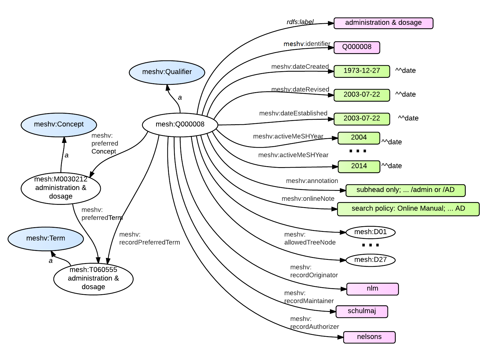

### RDF Graph Diagram

{: class="rdf-graph"}


### SPARQL

The RDF output above can be generated with the following
<span class='invoke-sparql'>SPARQL query</span>:


```sparql
prefix mesh: <http://id.nlm.nih.gov/mesh/>
prefix meshv: <http://id.nlm.nih.gov/mesh/vocab#>
construct {
    mesh:Q000008 ?p ?o .
    mesh:Q000008 meshv:preferredConcept ?prefCon .
    ?prefCon a ?prefConType .
    mesh:Q000008 meshv:recordPreferredTerm ?prefTerm .
    ?prefTerm a ?prefTermType .
    ?prefCon ?pct ?prefTerm .
}
from <http://id.nlm.nih.gov/mesh2014>
where {
    mesh:Q000008 ?p ?o .
    mesh:Q000008 meshv:preferredConcept ?prefCon .
    ?prefCon a ?prefConType .
    mesh:Q000008 meshv:recordPreferredTerm ?prefTerm .
    ?prefTerm a ?prefTermType .
    ?prefCon ?pct ?prefTerm .
}
```

###MeSH RDF Data

```
@prefix rdf:  <http://www.w3.org/1999/02/22-rdf-syntax-ns#> .
@prefix mesh: <http://id.nlm.nih.gov/mesh/> .
@prefix meshv:  <http://id.nlm.nih.gov/mesh/vocab#> .
@prefix rdfs: <http://www.w3.org/2000/01/rdf-schema#> .
@prefix dcterms:  <http://purl.org/dc/terms/> .
@prefix xsd:  <http://www.w3.org/2001/XMLSchema#> .

mesh:Q000008  rdf:type  meshv:Qualifier ;
              rdfs:label  "administration & dosage" ;
              dcterms:identifier  "Q000008" ;
              meshv:dateCreated "1973-12-27"^^xsd:date ;
              meshv:dateRevised "2003-07-22"^^xsd:date ;
              meshv:dateEstablished "1966-01-01"^^xsd:date ;
              meshv:activeMeSHYear  "2004-01-01"^^xsd:date ,
                                    ...
                                    "2014-01-01"^^xsd:date;
              meshv:annotation  "subhead only; for ... or /AD" ;
              meshv:onlineNote  "search policy: ... SUBS APPLY AD" .
              meshv:allowedTreeNode mesh:D01 ,
                                    mesh:D27 ;
              meshv:recordOriginator  "nlm" ;
              meshv:recordMaintainer  "schulmaj" ;
              meshv:recordAuthorizer  "nelsons" ;
              meshv:preferredConcept  mesh:M0030212 ;
              meshv:recordPreferredTerm mesh:T060555 ;
              meshv:historyNote "66; used with Category D 1966-90 forward" ;
              meshv:treeNumber  mesh:Y10.010 ,
                                mesh:Y07.010 ;

mesh:M0030212 rdf:type  meshv:Concept ;
              meshv:preferredTerm mesh:T060555 .

mesh:T060555  rdf:type  meshv:Term .
```

### MeSH XML

```xml
<QualifierRecord QualifierType="1">
  <QualifierUI>Q000008</QualifierUI>
  <QualifierName>
    <String>administration &amp; dosage</String>
  </QualifierName>
  <DateCreated>
    <Year>1973</Year>
    <Month>12</Month>
    <Day>27</Day>
  </DateCreated>
  <DateRevised>
    <Year>2003</Year>
    <Month>07</Month>
    <Day>22</Day>
  </DateRevised>
  <DateEstablished>
    <Year>1966</Year>
    <Month>01</Month>
    <Day>01</Day>
  </DateEstablished>
  <ActiveMeSHYearList>
    <Year>2004</Year>
    ...
    <Year>2014</Year>
  </ActiveMeSHYearList>
  <Annotation>subhead only; for routes of administration, timing, amounts of doses; not for "dosage"
    in Romance languages ( = /analysis) ; see MeSH scope note in Introduction; indexing policy:
    Manual 19.8.2; DF: /admin or /AD </Annotation>
  <HistoryNote>66; used with Category D 1966-90 forward </HistoryNote>
  <OnlineNote>search policy: Online Manual; use: main heading/AD or AD (SH) or SUBS APPLY AD </OnlineNote>
  <TreeNumberList>
    <TreeNumber>Y07.010</TreeNumber>
    <TreeNumber>Y10.010</TreeNumber>
  </TreeNumberList>
  <TreeNodeAllowedList>
    <TreeNodeAllowed>D01</TreeNodeAllowed>
    ...
    <TreeNodeAllowed>D27</TreeNodeAllowed>
  </TreeNodeAllowedList>
  <RecordOriginatorsList>
    <RecordOriginator>nlm</RecordOriginator>
    <RecordMaintainer>schulmaj</RecordMaintainer>
    <RecordAuthorizer>nelsons</RecordAuthorizer>
  </RecordOriginatorsList>
  <ConceptList>
    <Concept PreferredConceptYN="Y">
      <ConceptUI>M0030212</ConceptUI>
      ...
      <TermList>
        <Term ConceptPreferredTermYN="Y" IsPermutedTermYN="N" LexicalTag="NON" PrintFlagYN="Y"
          RecordPreferredTermYN="Y">
          <TermUI>T060555</TermUI>
          <String>administration &amp; dosage</String>
          ...
        </Term>
      </TermList>
    </Concept>
  </ConceptList>
</QualifierRecord>
```
