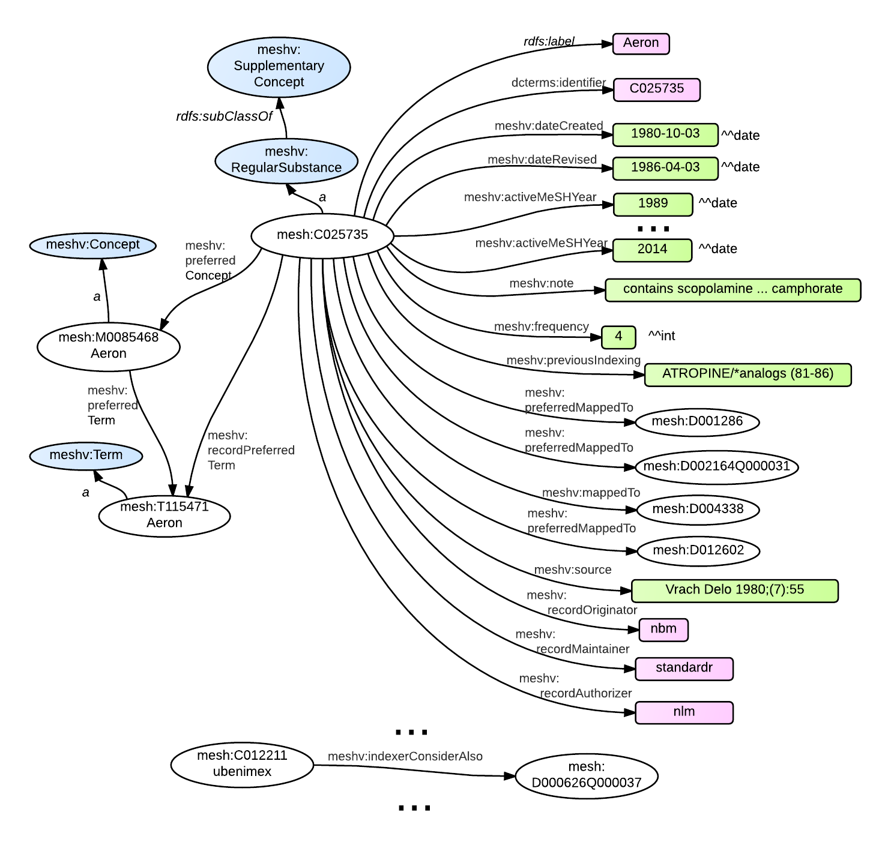

Supplementary Concept Records are created in MeSH to account for the large volume of chemical names that are found in biomedical literature. In MeSH RDF, these are represented by the super class meshv:SupplementaryConceptRecord, which has three sub-classes:

*  meshv:SCR_Chemical
*  meshv:SCR_Disease
*  meshv:SCR_Protocol


### RDF Graph Diagram

{: class="rdf-graph img-responsive"}

### meshv:SupplementaryConceptRecord - Relations and Properties

{::options parse_block_html="true" /}

{: #tabs}
<div>

*  [Relations to other classes (as subject)](#tabs-1)
*  [Relations to other classes (as object)](#tabs-2)
*  [meshv:SupplementaryConceptRecord properties](#tabs-3)

{: #tabs-1}
<div>

{:.data-table-long .row-border .hover }
Subject | Predicate | Object
------- | --------- | -------
meshv:SCR_Chemical | meshv:concept | meshv:Concept
meshv:SCR_Chemical | meshv:indexerConsiderAlso | meshv:AllowedDescriptorQualifierPair
meshv:SCR_Chemical | meshv:indexerConsiderAlso | meshv:Descriptor
meshv:SCR_Chemical | meshv:indexerConsiderAlso | meshv:DescriptorQualifierPair
meshv:SCR_Chemical | meshv:indexerConsiderAlso | meshv:DisallowedDescriptorQualifierPair
meshv:SCR_Chemical | meshv:indexerConsiderAlso | meshv:TopicalDescriptor
meshv:SCR_Chemical | meshv:mappedTo | meshv:Descriptor
meshv:SCR_Chemical | meshv:mappedTo | meshv:TopicalDescriptor
meshv:SCR_Chemical | meshv:pharmacologicalAction | meshv:Descriptor
meshv:SCR_Chemical | meshv:pharmacologicalAction | meshv:TopicalDescriptor
meshv:SCR_Chemical | meshv:preferredConcept | meshv:Concept
meshv:SCR_Chemical | meshv:preferredMappedTo | meshv:AllowedDescriptorQualifierPair
meshv:SCR_Chemical | meshv:preferredMappedTo | meshv:Descriptor
meshv:SCR_Chemical | meshv:preferredMappedTo | meshv:DescriptorQualifierPair
meshv:SCR_Chemical | meshv:preferredMappedTo | meshv:TopicalDescriptor
meshv:SCR_Chemical | meshv:preferredTerm | meshv:Term
meshv:SCR_Disease | meshv:concept | meshv:Concept
meshv:SCR_Disease | meshv:indexerConsiderAlso | meshv:Descriptor
meshv:SCR_Disease | meshv:indexerConsiderAlso | meshv:TopicalDescriptor
meshv:SCR_Disease | meshv:mappedTo | meshv:AllowedDescriptorQualifierPair
meshv:SCR_Disease | meshv:mappedTo | meshv:Descriptor
meshv:SCR_Disease | meshv:mappedTo | meshv:DescriptorQualifierPair
meshv:SCR_Disease | meshv:mappedTo | meshv:TopicalDescriptor
meshv:SCR_Disease | meshv:preferredConcept | meshv:Concept
meshv:SCR_Disease | meshv:preferredMappedTo | meshv:AllowedDescriptorQualifierPair
meshv:SCR_Disease | meshv:preferredMappedTo | meshv:Descriptor
meshv:SCR_Disease | meshv:preferredMappedTo | meshv:DescriptorQualifierPair
meshv:SCR_Disease | meshv:preferredMappedTo | meshv:TopicalDescriptor
meshv:SCR_Disease | meshv:preferredTerm | meshv:Term
meshv:SCR_Protocol | meshv:concept | meshv:Concept
meshv:SCR_Protocol | meshv:indexerConsiderAlso | meshv:Descriptor
meshv:SCR_Protocol | meshv:indexerConsiderAlso | meshv:TopicalDescriptor
meshv:SCR_Protocol | meshv:mappedTo | meshv:Descriptor
meshv:SCR_Protocol | meshv:mappedTo | meshv:TopicalDescriptor
meshv:SCR_Protocol | meshv:pharmacologicalAction | meshv:Descriptor
meshv:SCR_Protocol | meshv:pharmacologicalAction | meshv:TopicalDescriptor
meshv:SCR_Protocol | meshv:preferredConcept | meshv:Concept
meshv:SCR_Protocol | meshv:preferredMappedTo | meshv:AllowedDescriptorQualifierPair
meshv:SCR_Protocol | meshv:preferredMappedTo | meshv:Descriptor
meshv:SCR_Protocol | meshv:preferredMappedTo | meshv:DescriptorQualifierPair
meshv:SCR_Protocol | meshv:preferredMappedTo | meshv:TopicalDescriptor
meshv:SCR_Protocol | meshv:preferredTerm | meshv:Term
meshv:SupplementaryConceptRecord | meshv:concept | meshv:Concept
meshv:SupplementaryConceptRecord | meshv:indexerConsiderAlso | meshv:AllowedDescriptorQualifierPair
meshv:SupplementaryConceptRecord | meshv:indexerConsiderAlso | meshv:Descriptor
meshv:SupplementaryConceptRecord | meshv:indexerConsiderAlso | meshv:DescriptorQualifierPair
meshv:SupplementaryConceptRecord | meshv:indexerConsiderAlso | meshv:DisallowedDescriptorQualifierPair
meshv:SupplementaryConceptRecord | meshv:indexerConsiderAlso | meshv:TopicalDescriptor
meshv:SupplementaryConceptRecord | meshv:mappedTo | meshv:AllowedDescriptorQualifierPair
meshv:SupplementaryConceptRecord | meshv:mappedTo | meshv:Descriptor
meshv:SupplementaryConceptRecord | meshv:mappedTo | meshv:DescriptorQualifierPair
meshv:SupplementaryConceptRecord | meshv:mappedTo | meshv:TopicalDescriptor
meshv:SupplementaryConceptRecord | meshv:pharmacologicalAction | meshv:Descriptor
meshv:SupplementaryConceptRecord | meshv:pharmacologicalAction | meshv:TopicalDescriptor
meshv:SupplementaryConceptRecord | meshv:preferredConcept | meshv:Concept
meshv:SupplementaryConceptRecord | meshv:preferredMappedTo | meshv:AllowedDescriptorQualifierPair
meshv:SupplementaryConceptRecord | meshv:preferredMappedTo | meshv:Descriptor
meshv:SupplementaryConceptRecord | meshv:preferredMappedTo | meshv:DescriptorQualifierPair
meshv:SupplementaryConceptRecord | meshv:preferredMappedTo | meshv:TopicalDescriptor
meshv:SupplementaryConceptRecord | meshv:preferredTerm | meshv:Term

</div>

{: #tabs-2}
<div>

{:.data-table-long .row-border .hover}
Subject | Predicate | Object
------- | --------- | -------
N/A | N/A | N/A

</div>

{: #tabs-3}
<div>
{:.data-table-long .row-border .hover}
Subject | Predicate
------- | ---------
meshv:SCR_Chemical | meshv:dateCreated
meshv:SCR_Chemical | meshv:dateRevised
meshv:SCR_Chemical | meshv:frequency
meshv:SCR_Chemical | meshv:identifier
meshv:SCR_Chemical | meshv:note
meshv:SCR_Chemical | meshv:previousIndexing
meshv:SCR_Chemical | meshv:source
meshv:SCR_Chemical | rdfs:label
meshv:SCR_Disease | meshv:dateCreated
meshv:SCR_Disease | meshv:dateRevised
meshv:SCR_Disease | meshv:frequency
meshv:SCR_Disease | meshv:identifier
meshv:SCR_Disease | meshv:note
meshv:SCR_Disease | meshv:previousIndexing
meshv:SCR_Disease | meshv:source
meshv:SCR_Disease | rdfs:label
meshv:SCR_Protocol | meshv:dateCreated
meshv:SCR_Protocol | meshv:dateRevised
meshv:SCR_Protocol | meshv:frequency
meshv:SCR_Protocol | meshv:identifier
meshv:SCR_Protocol | meshv:note
meshv:SCR_Protocol | meshv:previousIndexing
meshv:SCR_Protocol | meshv:source
meshv:SCR_Protocol | rdfs:label
meshv:SupplementaryConceptRecord | meshv:dateCreated
meshv:SupplementaryConceptRecord | meshv:dateRevised
meshv:SupplementaryConceptRecord | meshv:frequency
meshv:SupplementaryConceptRecord | meshv:identifier
meshv:SupplementaryConceptRecord | meshv:note
meshv:SupplementaryConceptRecord | meshv:previousIndexing
meshv:SupplementaryConceptRecord | meshv:source
meshv:SupplementaryConceptRecord | rdfs:label

</div>
</div>

### SPARQL

The RDF output above can be generated with the following
<span class='invoke-sparql'>SPARQL query</span>:


```sparql
PREFIX rdfs: <http://www.w3.org/2000/01/rdf-schema#>
prefix mesh: <http://id.nlm.nih.gov/mesh/>
prefix meshv: <http://id.nlm.nih.gov/mesh/vocab#>
construct {
    mesh:C025735 ?p ?o .
    mesh:C025735 a ?scrClass .
    ?scrClass rdfs:subClassOf $scrSuperClass .
    mesh:C025735 meshv:preferredConcept ?prefCon .
    ?prefCon a ?prefConType .
    mesh:C025735 meshv:preferredTerm ?prefTerm .
    ?prefTerm a ?prefTermType .
    ?prefCon ?pct ?prefTerm .

    mesh:C012211 meshv:indexerConsiderAlso ?ica .
}
from <http://id.nlm.nih.gov/mesh2014>
where {
    mesh:C025735 ?p ?o .
    mesh:C025735 a ?scrClass .
    ?scrClass rdfs:subClassOf $scrSuperClass .
    mesh:C025735 meshv:preferredConcept ?prefCon .
    ?prefCon a ?prefConType .
    mesh:C025735 meshv:preferredTerm ?prefTerm .
    ?prefTerm a ?prefTermType .
    ?prefCon ?pct ?prefTerm .

    mesh:C012211 meshv:indexerConsiderAlso ?ica .
}
```

### MeSH RDF Data

```
<http://id.nlm.nih.gov/mesh/C012211>
        <http://id.nlm.nih.gov/mesh/vocab#indexerConsiderAlso>
                <http://id.nlm.nih.gov/mesh/D000626Q000037> .

<http://id.nlm.nih.gov/mesh/C025735>
        a       <http://id.nlm.nih.gov/mesh/vocab#RegularSubstance> ;
        <http://www.w3.org/2000/01/rdf-schema#label>
                "Aeron" ;
                ...
                "2014-01-01"^^<http://www.w3.org/2001/XMLSchema#date>;
        <http://id.nlm.nih.gov/mesh/vocab#dateCreated>
                "1980-10-03"^^<http://www.w3.org/2001/XMLSchema#date> ;
        <http://id.nlm.nih.gov/mesh/vocab#dateRevised>
                "1986-04-03"^^<http://www.w3.org/2001/XMLSchema#date> ;
        <http://id.nlm.nih.gov/mesh/vocab#frequency>
                "4"^^<http://www.w3.org/2001/XMLSchema#int> ;
        <http://id.nlm.nih.gov/mesh/vocab#mappedTo>
                <http://id.nlm.nih.gov/mesh/D004338> ;
        <http://id.nlm.nih.gov/mesh/vocab#note>
                "contains scopolamine camphorate mixture with (-)-atropine camphorate" ;
        <http://id.nlm.nih.gov/mesh/vocab#preferredConcept>
                <http://id.nlm.nih.gov/mesh/M0085468> ;
        <http://id.nlm.nih.gov/mesh/vocab#preferredMappedTo>
                <http://id.nlm.nih.gov/mesh/D012602> , 
                <http://id.nlm.nih.gov/mesh/D002164Q000031> , 
                <http://id.nlm.nih.gov/mesh/D001286> ;
        <http://id.nlm.nih.gov/mesh/vocab#previousIndexing>
                "ATROPINE/*analogs (81-86)" ;
        <http://id.nlm.nih.gov/mesh/vocab#preferredTerm>
                <http://id.nlm.nih.gov/mesh/T115471> ;
        <http://id.nlm.nih.gov/mesh/vocab#source>
                "Vrach Delo 1980;(7):55" ;
        <http://purl.org/dc/terms/identifier>
                "C025735" .

<http://id.nlm.nih.gov/mesh/M0085468>
        a       <http://id.nlm.nih.gov/mesh/vocab#Concept> ;
        <http://id.nlm.nih.gov/mesh/vocab#preferredTerm>
                <http://id.nlm.nih.gov/mesh/T115471> .

<http://id.nlm.nih.gov/mesh/vocab#RegularSubstance>
        <http://www.w3.org/2000/01/rdf-schema#subClassOf>
                <http://id.nlm.nih.gov/mesh/vocab#SupplementaryConceptRecord> .

<http://id.nlm.nih.gov/mesh/T115471>
        a       <http://id.nlm.nih.gov/mesh/vocab#Term> .
```

### MeSH XML

The MeSH RDF was derived from non-RDF MeSH XML. Compare the RDF graph diagram and the RDF data above to the truncated MeSH XML below.

```xml
<SupplementalRecord SCRClass="1">
  <SupplementalRecordUI>C025735</SupplementalRecordUI>
  <SupplementalRecordName>
    <String>Aeron</String>
  </SupplementalRecordName>
  <DateCreated>
    <Year>1980</Year>
    <Month>10</Month>
    <Day>03</Day>
  </DateCreated>
  <DateRevised>
    <Year>1986</Year>
    <Month>04</Month>
    <Day>03</Day>
  </DateRevised>
    ...
  <Note>contains scopolamine camphorate mixture with (-)-atropine camphorate </Note>
  <Frequency>4</Frequency>
  <PreviousIndexingList>
    <PreviousIndexing>ATROPINE/*analogs (81-86)</PreviousIndexing>
  </PreviousIndexingList>
  <HeadingMappedToList>
    <HeadingMappedTo>
      <DescriptorReferredTo>
        <DescriptorUI>*D001286</DescriptorUI>
        <DescriptorName>
          <String>Atropine Derivatives</String>
        </DescriptorName>
      </DescriptorReferredTo>
    </HeadingMappedTo>
    <HeadingMappedTo>
      <DescriptorReferredTo>
        <DescriptorUI>D002164</DescriptorUI>
        <DescriptorName>
          <String>Camphor</String>
        </DescriptorName>
      </DescriptorReferredTo>
      <QualifierReferredTo>
        <QualifierUI>*Q000031</QualifierUI>
        <QualifierName>
          <String>analogs &amp; derivatives</String>
        </QualifierName>
      </QualifierReferredTo>
    </HeadingMappedTo>
    <HeadingMappedTo>
      <DescriptorReferredTo>
        <DescriptorUI>D004338</DescriptorUI>
        <DescriptorName>
          <String>Drug Combinations</String>
        </DescriptorName>
      </DescriptorReferredTo>
    </HeadingMappedTo>
    <HeadingMappedTo>
      <DescriptorReferredTo>
        <DescriptorUI>*D012602</DescriptorUI>
        <DescriptorName>
          <String>Scopolamine Derivatives</String>
        </DescriptorName>
      </DescriptorReferredTo>
    </HeadingMappedTo>
  </HeadingMappedToList>
  <SourceList>
    <Source>Vrach Delo 1980;(7):55</Source>
  </SourceList>
  <ConceptList>
    <Concept PreferredConceptYN="Y">
      <ConceptUI>M0085468</ConceptUI>
      <ConceptName>
        <String>Aeron</String>
      </ConceptName>
      <RegistryNumber>72539-79-8</RegistryNumber>
      <TermList>
        <Term ConceptPreferredTermYN="Y" IsPermutedTermYN="N" LexicalTag="NON" PrintFlagYN="Y"
          RecordPreferredTermYN="Y">
          <TermUI>T115471</TermUI>
          <String>Aeron</String>
          <ThesaurusIDlist>
            <ThesaurusID>NLM (1980)</ThesaurusID>
          </ThesaurusIDlist>
        </Term>
      </TermList>
    </Concept>
  </ConceptList>
</SupplementalRecord>
...
<SupplementalRecord SCRClass="1">
  <SupplementalRecordUI>C012211</SupplementalRecordUI>
  <SupplementalRecordName>
    <String>ubenimex</String>
  </SupplementalRecordName>
  ...
  <IndexingInformationList>
    <IndexingInformation>
      <DescriptorReferredTo>
        <DescriptorUI>D000626</DescriptorUI>
        <DescriptorName>
          <String>Aminopeptidases</String>
        </DescriptorName>
      </DescriptorReferredTo>
      <QualifierReferredTo>
        <QualifierUI>Q000037</QualifierUI>
        <QualifierName>
          <String>antagonists &amp; inhibitors</String>
        </QualifierName>
      </QualifierReferredTo>
    </IndexingInformation>
  </IndexingInformationList>
  ...
</SupplementalRecord>
```

### Notes

There are three possible values for the *SCRClass* attribute (see the [XML
documentation](http://www.nlm.nih.gov/mesh/xml_data_elements.html#SCRClass), which result in three
rdfs:Classes:

* 1 - meshv:SCR_Chemical
* 2 - meshv:SCR_Protocol
* 3 - meshv:SCR_Disease

Each of these is an rdfs:subClassOf meshv:SupplementaryConceptRecord.

