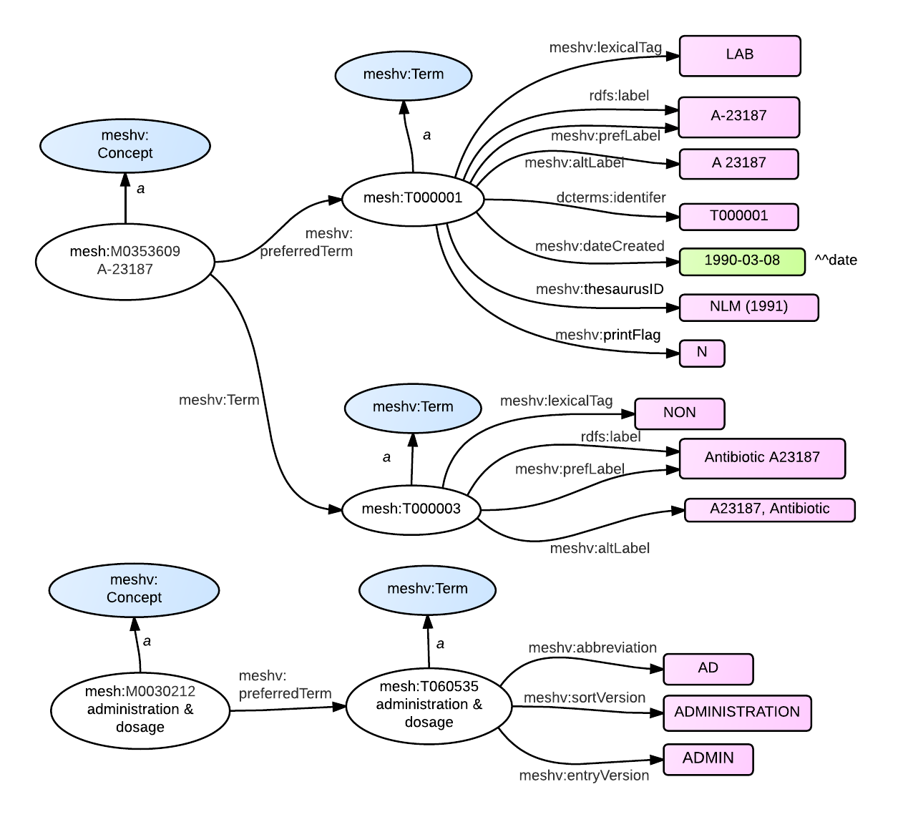

* Also need an example for Term/Abbreviation; Term/SortVersion, and Term/EntryVersion - use T060555, which is a descendent of the *qualifier* Q000008, administration and dosage. (We'll add a drawing for this under Qualifiers)

{: .jump}
&#91; jump to [term properties](#properties) or [term relations](#relations) &#93;

### <a name = "properties"/>RDF Graph Model - Term Properties

{: class="rdf-graph"}


### SPARQL - Term Properties

The following <span class='invoke-sparql'>SPARQL query</span> produces the graphs depicted in the
figures above:

```sparql
PREFIX mesh: <http://id.nlm.nih.gov/mesh/>
PREFIX meshv: <http://id.nlm.nih.gov/mesh/vocab#>

construct {
    mesh:M0353609 rdfs:label ?con1Label .
    mesh:M0353609 a ?con1Class .

    mesh:M0353609 meshv:preferredTerm ?con1PrefTerm .
    ?con1PrefTerm a ?con1PrefTermClass .
    ?con1PrefTerm ?con1PrefTerm_p ?con1PrefTerm_o .

    mesh:M0353609 meshv:term ?con1Term .
    ?con1Term a ?con1TermClass .
    ?con1Term ?con1Term_p ?con1Term_o .

    mesh:M0030212 rdfs:label ?con2Label .
    mesh:M0030212 a ?con2Class .
    mesh:M0030212 meshv:preferredTerm ?con2PrefTerm .
    ?con2PrefTerm a ?con2PrefTermClass .
    ?con2PrefTerm ?con2PrefTerm_p ?con2PrefTerm_o .
}
FROM <http://id.nlm.nih.gov/mesh2014>
where {
    mesh:M0353609 rdfs:label ?con1Label .
    mesh:M0353609 a ?con1Class .

    mesh:M0353609 meshv:preferredTerm ?con1PrefTerm .
    ?con1PrefTerm a ?con1PrefTermClass .
    ?con1PrefTerm ?con1PrefTerm_p ?con1PrefTerm_o .

    mesh:M0353609 meshv:term ?con1Term .
    ?con1Term a ?con1TermClass .
    ?con1Term ?con1Term_p ?con1Term_o .

    mesh:M0030212 rdfs:label ?con2Label .
    mesh:M0030212 a ?con2Class .
    mesh:M0030212 meshv:preferredTerm ?con2PrefTerm .
    ?con2PrefTerm a ?con2PrefTermClass .
    ?con2PrefTerm ?con2PrefTerm_p ?con2PrefTerm_o .
}
```

### MeSH RDF - Term Properties

```
<http://id.nlm.nih.gov/mesh/T000003>
        a       <http://id.nlm.nih.gov/mesh/vocab#Term> ;
        ...
        <http://id.nlm.nih.gov/mesh/vocab#altLabel>
                "A23187, Antibiotic" ;
        ...
        <http://id.nlm.nih.gov/mesh/vocab#lexicalTag>
                "NON" ;
        <http://id.nlm.nih.gov/mesh/vocab#prefLabel>
                "Antibiotic A23187" ;
        ...
        <http://purl.org/dc/terms/identifier>
                "T000003" .

<http://id.nlm.nih.gov/mesh/T000001>
        a       <http://id.nlm.nih.gov/mesh/vocab#Term> ;
        <http://www.w3.org/2000/01/rdf-schema#label>
                "A-23187" ;
        <http://id.nlm.nih.gov/mesh/vocab#altLabel>
                "A 23187" ;
        <http://id.nlm.nih.gov/mesh/vocab#dateCreated>
                "1990-03-08"^^<http://www.w3.org/2001/XMLSchema#date> ;
        <http://id.nlm.nih.gov/mesh/vocab#lexicalTag>
                "LAB" ;
        <http://id.nlm.nih.gov/mesh/vocab#prefLabel>
                "A-23187" ;
        <http://id.nlm.nih.gov/mesh/vocab#printFlag>
                "N" ;
        <http://id.nlm.nih.gov/mesh/vocab#thesaurusID>
                "NLM (1991)" ;
        <http://purl.org/dc/terms/identifier>
                "T000001" .
        ...
<http://id.nlm.nih.gov/mesh/M0353609>
        a       <http://id.nlm.nih.gov/mesh/vocab#Concept> ;
        <http://www.w3.org/2000/01/rdf-schema#label>
                "A-23187" ;
        <http://id.nlm.nih.gov/mesh/vocab#preferredTerm>
                <http://id.nlm.nih.gov/mesh/T000001> ;
        <http://id.nlm.nih.gov/mesh/vocab#term>
                ...
                <http://id.nlm.nih.gov/mesh/T000003> .

<http://id.nlm.nih.gov/mesh/T060555>
        a       <http://id.nlm.nih.gov/mesh/vocab#Term> ;
        ...
        <http://id.nlm.nih.gov/mesh/vocab#abbreviation>
                "AD" ;
        <http://id.nlm.nih.gov/mesh/vocab#entryVersion>
                "ADMIN" ;
        ...
        <http://id.nlm.nih.gov/mesh/vocab#sortVersion>
                "ADMINISTRATION A" ;
        <http://purl.org/dc/terms/identifier>
                "T060555" .

<http://id.nlm.nih.gov/mesh/M0030212>
        a       <http://id.nlm.nih.gov/mesh/vocab#Concept> ;
        <http://www.w3.org/2000/01/rdf-schema#label>
                "administration & dosage" ;
        <http://id.nlm.nih.gov/mesh/vocab#preferredTerm>
                <http://id.nlm.nih.gov/mesh/T060555> .
```


### MeSH XML - Term Properties

The MeSH RDF was derived from non-RDF MeSH XML. Compare the RDF graph diagram and the RDF data above to the truncated MeSH XML below.

```xml
<DescriptorRecord DescriptorClass = "1">
  <DescriptorUI>D000001</DescriptorUI>
  ...
  <Concept PreferredConceptYN="N">
    <ConceptUI>M0353609</ConceptUI>
    <ConceptName>
      <String>A-23187</String>
    </ConceptName>
    ...
    <TermList>
      <Term ConceptPreferredTermYN="Y" IsPermutedTermYN="N" LexicalTag="LAB" PrintFlagYN="N"
        RecordPreferredTermYN="N">
        <TermUI>T000001</TermUI>
        <String>A-23187</String>
        <DateCreated>
          <Year>1990</Year>
          <Month>03</Month>
          <Day>08</Day>
        </DateCreated>
        <ThesaurusIDlist>
          <ThesaurusID>NLM (1991)</ThesaurusID>
        </ThesaurusIDlist>
      </Term>
      <Term ConceptPreferredTermYN="N" IsPermutedTermYN="Y" LexicalTag="LAB" PrintFlagYN="N"
        RecordPreferredTermYN="N">
        <TermUI>T000001</TermUI>
        <String>A 23187</String>
      </Term>
      <Term ConceptPreferredTermYN="N" IsPermutedTermYN="N" LexicalTag="NON" PrintFlagYN="N"
        RecordPreferredTermYN="N">
        <TermUI>T000003</TermUI>
        <String>Antibiotic A23187</String>
        ...
      </Term>
      <Term ConceptPreferredTermYN="N" IsPermutedTermYN="Y" LexicalTag="NON" PrintFlagYN="N"
        RecordPreferredTermYN="N">
        <TermUI>T000003</TermUI>
        <String>A23187, Antibiotic</String>
      </Term>
      ...
    </TermList>
  </Concept>
</DescriptorRecord>
...
<QualifierRecord QualifierType = "1">
  <QualifierUI>Q000008</QualifierUI>
  ...
  <Concept PreferredConceptYN="Y">
    <ConceptUI>M0030212</ConceptUI>
    <ConceptName>
      <String>administration &amp; dosage</String>
    </ConceptName>
    ...
    <TermList>
      <Term ConceptPreferredTermYN="Y" IsPermutedTermYN="N" LexicalTag="NON" PrintFlagYN="Y"
        RecordPreferredTermYN="Y">
        <TermUI>T060555</TermUI>
        <String>administration &amp; dosage</String>
        <Abbreviation>AD</Abbreviation>
        <SortVersion>ADMINISTRATION A</SortVersion>
        <EntryVersion>ADMIN</EntryVersion>
      </Term>
    </TermList>
  </Concept>
</QualifierRecord>
```

### meshv:Term - Relations and Properties

{::options parse_block_html="true" /}

{: #tabs}
<div>

*  [Relations to other classes (as subject)](#tabs-1)
*  [Relations to other classes (as object)](#tabs-2)
*  [meshv:Term properties](#tabs-3)

{: #tabs-1}
<div>

{:.data-table-standard .row-border .hover }
Subject | Predicate | Object
------- | --------- | -------
meshv:Term | rdf:type | rdfs:Class

</div>

{: #tabs-2}
<div>

{:.data-table-standard .row-border .hover}
Subject | Predicate | Object
------- | --------- | -------
meshv:Concept | meshv:preferredTerm | meshv:Term
meshv:Concept | meshv:term | meshv:Term
meshv:Qualifier | meshv:recordPreferredTerm | meshv:Term
meshv:TopicalDescriptor | meshv:recordPreferredTerm | meshv:Term
meshv:Descriptor | meshv:recordPreferredTerm | meshv:Term
meshv:GeographicalDescriptor | meshv:recordPreferredTerm | meshv:Term
meshv:PublicationType | meshv:recordPreferredTerm | meshv:Term
meshv:RegularSubstance | meshv:recordPreferredTerm | meshv:Term
meshv:SupplementaryConcept | meshv:recordPreferredTerm | meshv:Term
meshv:Protocol | meshv:recordPreferredTerm | meshv:Term
meshv:RareDisease | meshv:recordPreferredTerm | meshv:Term
meshv:CheckTag | meshv:recordPreferredTerm | meshv:Term

</div>

{: #tabs-3}
<div>
{:.data-table-standard .row-border .hover}
Subject | Predicate
------- | ---------
meshv:Term | rdfs:label
meshv:Term | dcterms:identifier
meshv:Term | meshv:abbreviation
meshv:Term | meshv:entryVersion
meshv:Term | meshv:lexicalTag
meshv:Term | meshv:printFlag
meshv:Term | meshv:sortVersion
meshv:Term | meshv:prefLabel
meshv:Term | meshv:dateCreated
meshv:Term | meshv:thesaurusID
meshv:Term | meshv:altLabel

</div>
</div>

###<a name = "relations"/>RDF Graph Model - Term Relations

Depicted in these graphs:

{: class="rdf-graph"}

### SPARQL - Term Relations

[Note that the following should be possible using the short `CONSTRUCT WHERE` form,
as described in [the SPARQL specification](http://www.w3.org/TR/2013/REC-sparql11-query-20130321/#constructWhere),
but it seems that Virtuoso doesn't support it.]

The following <span class='invoke-sparql'>SPARQL query</span> produces the graphs depicted in the
figures above:

```sparql
PREFIX mesh: <http://id.nlm.nih.gov/mesh/>
PREFIX meshv: <http://id.nlm.nih.gov/mesh/vocab#>

construct {
    mesh:D000001 a ?descClass .
    ?descClass rdfs:subClassOf ?superClass .

    mesh:D000001 meshv:preferredConcept ?prefCon .
    ?prefCon a ?prefConClass .

    mesh:D000001 meshv:recordPreferredTerm ?prefTerm .
    ?prefCon meshv:preferredTerm ?prefTerm .
    ?prefTerm a ?prefTermClass .

    mesh:D000001 meshv:concept ?con .
    ?con a ?conClass .
    ?con meshv:preferredTerm ?conPrefTerm .
    ?conPrefTerm a ?conPrefTermClass .

    ?con meshv:term ?conTerm .
    ?conTerm a ?conTermClass .
}
FROM <http://id.nlm.nih.gov/mesh2014>
where {
    mesh:D000001 a ?descClass .
    ?descClass rdfs:subClassOf ?superClass .

    mesh:D000001 meshv:preferredConcept ?prefCon .
    ?prefCon a ?prefConClass .

    mesh:D000001 meshv:recordPreferredTerm ?prefTerm .
    ?prefCon meshv:preferredTerm ?prefTerm .
    ?prefTerm a ?prefTermClass .

    mesh:D000001 meshv:concept ?con .
    ?con a ?conClass .
    ?con meshv:preferredTerm ?conPrefTerm .
    ?conPrefTerm a ?conPrefTermClass .

    ?con meshv:term ?conTerm .
    ?conTerm a ?conTermClass .
}
```

### MeSH RDF - Term Relations


```
<http://id.nlm.nih.gov/mesh/T000003>
        a       <http://id.nlm.nih.gov/mesh/vocab#Term> .

<http://id.nlm.nih.gov/mesh/T000001>
        a       <http://id.nlm.nih.gov/mesh/vocab#Term> .

<http://id.nlm.nih.gov/mesh/M0000001>
        a       <http://id.nlm.nih.gov/mesh/vocab#Concept> ;
        <http://id.nlm.nih.gov/mesh/vocab#preferredTerm>
                <http://id.nlm.nih.gov/mesh/T000002> .
...
<http://id.nlm.nih.gov/mesh/vocab#TopicalDescriptor>
        <http://www.w3.org/2000/01/rdf-schema#subClassOf>
                <http://id.nlm.nih.gov/mesh/vocab#Descriptor> .

<http://id.nlm.nih.gov/mesh/M0353609>
        a       <http://id.nlm.nih.gov/mesh/vocab#Concept> ;
        <http://id.nlm.nih.gov/mesh/vocab#preferredTerm>
                <http://id.nlm.nih.gov/mesh/T000001> ;
        <http://id.nlm.nih.gov/mesh/vocab#term>
                ...
                <http://id.nlm.nih.gov/mesh/T000003> .

<http://id.nlm.nih.gov/mesh/T000002>
        a       <http://id.nlm.nih.gov/mesh/vocab#Term> .

<http://id.nlm.nih.gov/mesh/D000001>
        a       <http://id.nlm.nih.gov/mesh/vocab#TopicalDescriptor> ;
        <http://id.nlm.nih.gov/mesh/vocab#concept>
                <http://id.nlm.nih.gov/mesh/M0353609> ;
        <http://id.nlm.nih.gov/mesh/vocab#preferredConcept>
                <http://id.nlm.nih.gov/mesh/M0000001> ;
        <http://id.nlm.nih.gov/mesh/vocab#recordPreferredTerm>
                <http://id.nlm.nih.gov/mesh/T000002> .
```

Notes:

* The [RecordPreferredTermYN attribute](http://www.nlm.nih.gov/mesh/xml_data_elements.html#RecordPreferredTermYN)
  in the XML is used to directly connect a record (in this
  case, a Descriptor) to its preferred term, using the `meshv:preferredTerm` property, which is an
  `rdfs:subPropertyOf` `meshv:term`.

* The [IsPermutedTermYN
  attribute](http://www.nlm.nih.gov/mesh/xml_data_elements.html#IsPermutedTermYN) is used to determine the
  properties to use for a given label.  If IsPermutedTermYN is "N", then `skos:prefLabel` is used.
  If it is "Y", then `skos:altLabel` is used.  For convenience, the preferred label is also indicated with
  the `rdfs:label` property.


### MeSH XML - Term Relations

The MeSH RDF was derived from non-RDF MeSH XML. Compare the RDF graph diagram and the RDF data above to the truncated MeSH XML below.

```xml
<DescriptorRecord DescriptorClass="1">
  <DescriptorUI>D000001</DescriptorUI>
  <DescriptorName>
    <String>Calcimycin</String>
  </DescriptorName>
  ...
  <ConceptList>
    <Concept PreferredConceptYN="Y">
      <ConceptUI>M0000001</ConceptUI>
      <ConceptName>
        <String>Calcimycin</String>
      </ConceptName>
      ...
      <TermList>
        <Term ConceptPreferredTermYN="Y" IsPermutedTermYN="N" LexicalTag="NON" PrintFlagYN="Y"
          RecordPreferredTermYN="Y">
          <TermUI>T000002</TermUI>
          <String>Calcimycin</String>
          ...
        </Term>
      </TermList>
    </Concept>
    <Concept PreferredConceptYN="N">
      <ConceptUI>M0353609</ConceptUI>
      <ConceptName>
        <String>A-23187</String>
      </ConceptName>
      ...
      <TermList>
        <Term ConceptPreferredTermYN="Y" IsPermutedTermYN="N" LexicalTag="LAB" PrintFlagYN="N"
          RecordPreferredTermYN="N">
          <TermUI>T000001</TermUI>
          <String>A-23187</String>
          <DateCreated>
            <Year>1990</Year>
            <Month>03</Month>
            <Day>08</Day>
          </DateCreated>
          <ThesaurusIDlist>
            <ThesaurusID>NLM (1991)</ThesaurusID>
          </ThesaurusIDlist>
        </Term>
        <Term ConceptPreferredTermYN="N" IsPermutedTermYN="Y" LexicalTag="LAB" PrintFlagYN="N"
          RecordPreferredTermYN="N">
          <TermUI>T000001</TermUI>
          <String>A 23187</String>
        </Term>
        <Term ConceptPreferredTermYN="N" IsPermutedTermYN="N" LexicalTag="NON" PrintFlagYN="N"
          RecordPreferredTermYN="N">
          <TermUI>T000003</TermUI>
          <String>Antibiotic A23187</String>
          ...
        </Term>
        <Term ConceptPreferredTermYN="N" IsPermutedTermYN="Y" LexicalTag="NON" PrintFlagYN="N"
          RecordPreferredTermYN="N">
          <TermUI>T000003</TermUI>
          <String>A23187, Antibiotic</String>
        </Term>
        ...
      </TermList>
    </Concept>
  </ConceptList>
</DescriptorRecord>
```
