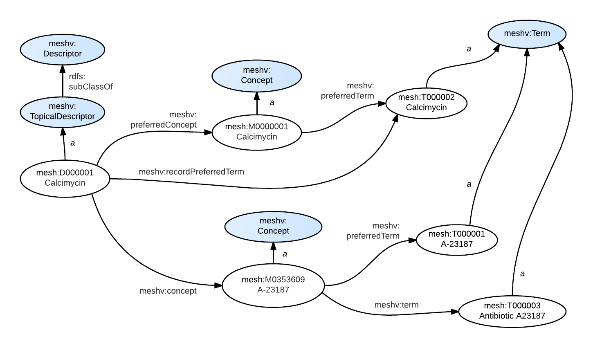

* Also need an example for Term/Abbreviation; Term/SortVersion, and Term/EntryVersion - use T060555, which is a descendent of the *qualifier* Q000008, administration and dosage. (We'll add a drawing for this under Qualifiers)

### RDF Graph Model

Depicted in these graphs:

{: class="rdf-graph"}

### SPARQL

[Note that the following should be possible using the short `CONSTRUCT WHERE` form,
as described in [the SPARQL specification](http://www.w3.org/TR/2013/REC-sparql11-query-20130321/#constructWhere),
but it seems that Virtuoso doesn't support it.]

The following <span class='invoke-sparql'>SPARQL query</span> produces the graphs depicted in the
figures above:

```sparql
PREFIX mesh: <http://id.nlm.nih.gov/mesh/>
PREFIX meshv: <http://id.nlm.nih.gov/mesh/vocab#>

construct {
    mesh:D000001 a ?descClass .
    ?descClass rdfs:subClassOf ?superClass .

    mesh:D000001 meshv:preferredConcept ?prefCon .
    ?prefCon a ?prefConClass .

    mesh:D000001 meshv:recordPreferredTerm ?prefTerm .
    ?prefCon meshv:preferredTerm ?prefTerm .
    ?prefTerm a ?prefTermClass .

    mesh:D000001 meshv:concept ?con .
    ?con a ?conClass .
    ?con meshv:preferredTerm ?conPrefTerm .
    ?conPrefTerm a ?conPrefTermClass .

    ?con meshv:term ?conTerm .
    ?conTerm a ?conTermClass .
}
FROM <http://id.nlm.nih.gov/mesh2014>
where {
    mesh:D000001 a ?descClass .
    ?descClass rdfs:subClassOf ?superClass .

    mesh:D000001 meshv:preferredConcept ?prefCon .
    ?prefCon a ?prefConClass .

    mesh:D000001 meshv:recordPreferredTerm ?prefTerm .
    ?prefCon meshv:preferredTerm ?prefTerm .
    ?prefTerm a ?prefTermClass .

    mesh:D000001 meshv:concept ?con .
    ?con a ?conClass .
    ?con meshv:preferredTerm ?conPrefTerm .
    ?conPrefTerm a ?conPrefTermClass .

    ?con meshv:term ?conTerm .
    ?conTerm a ?conTermClass .
}
```

### MeSH RDF


```
@prefix rdf:  <http://www.w3.org/1999/02/22-rdf-syntax-ns#> .
@prefix mesh: <http://id.nlm.nih.gov/mesh/> .
@prefix meshv:  <http://id.nlm.nih.gov/mesh/vocab#> .
@prefix rdfs: <http://www.w3.org/2000/01/rdf-schema#> .

mesh:D000001  rdf:type  meshv:TopicalDescriptor ;
              meshv:preferredConcept  mesh:M0000001 ;
              meshv:recordPreferredTerm mesh:T000002 ;
              meshv:concept mesh:M0353609 .
mesh:M0000001 rdf:type  meshv:Concept ;
              meshv:preferredTerm mesh:T000002 .
mesh:M0353609 rdf:type  meshv:Concept ;
              meshv:term  mesh:T000003 ,
                          mesh:T000004 ;
              meshv:preferredTerm mesh:T000001 .
mesh:T000002  rdf:type  meshv:Term .
mesh:T000001  rdf:type  meshv:Term .
mesh:T000003  rdf:type  meshv:Term .
mesh:T000004  rdf:type  meshv:Term .
meshv:TopicalDescriptor rdfs:subClassOf meshv:Descriptor .
```

Notes:

* The [RecordPreferredTermYN attribute](http://www.nlm.nih.gov/mesh/xml_data_elements.html#RecordPreferredTermYN)
  in the XML is used to directly connect a record (in this
  case, a Descriptor) to its preferred term, using the `meshv:preferredTerm` property, which is an
  `rdfs:subPropertyOf` `meshv:term`.

* The [IsPermutedTermYN
  attribute](http://www.nlm.nih.gov/mesh/xml_data_elements.html#IsPermutedTermYN) is used to determine the
  properties to use for a given label.  If IsPermutedTermYN is "N", then `skos:prefLabel` is used.
  If it is "Y", then `skos:altLabel` is used.  For convenience, the preferred label is also indicated with
  the `rdfs:label` property.


### MeSH XML

The MeSH RDF was derived from non-RDF MeSH XML. Compare the RDF graph diagram and the RDF data above to the truncated MeSH XML below.

```xml
<DescriptorRecord DescriptorClass="1">
  <DescriptorUI>D000001</DescriptorUI>
  <DescriptorName>
    <String>Calcimycin</String>
  </DescriptorName>
  ...
  <ConceptList>
    <Concept PreferredConceptYN="Y">
      <ConceptUI>M0000001</ConceptUI>
      <ConceptName>
        <String>Calcimycin</String>
      </ConceptName>
      ...
      <TermList>
        <Term ConceptPreferredTermYN="Y" IsPermutedTermYN="N" LexicalTag="NON" PrintFlagYN="Y"
          RecordPreferredTermYN="Y">
          <TermUI>T000002</TermUI>
          <String>Calcimycin</String>
          ...
        </Term>
      </TermList>
    </Concept>
    <Concept PreferredConceptYN="N">
      <ConceptUI>M0353609</ConceptUI>
      <ConceptName>
        <String>A-23187</String>
      </ConceptName>
      ...
      <TermList>
        <Term ConceptPreferredTermYN="Y" IsPermutedTermYN="N" LexicalTag="LAB" PrintFlagYN="N"
          RecordPreferredTermYN="N">
          <TermUI>T000001</TermUI>
          <String>A-23187</String>
          <DateCreated>
            <Year>1990</Year>
            <Month>03</Month>
            <Day>08</Day>
          </DateCreated>
          <ThesaurusIDlist>
            <ThesaurusID>NLM (1991)</ThesaurusID>
          </ThesaurusIDlist>
        </Term>
        <Term ConceptPreferredTermYN="N" IsPermutedTermYN="Y" LexicalTag="LAB" PrintFlagYN="N"
          RecordPreferredTermYN="N">
          <TermUI>T000001</TermUI>
          <String>A 23187</String>
        </Term>
        <Term ConceptPreferredTermYN="N" IsPermutedTermYN="N" LexicalTag="NON" PrintFlagYN="N"
          RecordPreferredTermYN="N">
          <TermUI>T000003</TermUI>
          <String>Antibiotic A23187</String>
          ...
        </Term>
        <Term ConceptPreferredTermYN="N" IsPermutedTermYN="Y" LexicalTag="NON" PrintFlagYN="N"
          RecordPreferredTermYN="N">
          <TermUI>T000003</TermUI>
          <String>A23187, Antibiotic</String>
        </Term>
        ...
      </TermList>
    </Concept>
  </ConceptList>
</DescriptorRecord>
```

