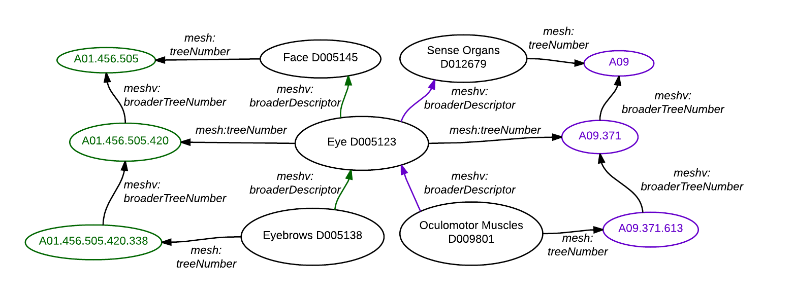

MeSH descriptors are organized into 16 categories, each of which is further divided into sub-categories to assist in more specific classification of a descriptor.
A given MeSH descriptor often has more than one tree number assigned to it.
In MeSH RDF, tree numbers are both classes in their own right (meshv:TreeNumber),  as well as properties of a meshv:Descriptor via the meshv:treeNumber predicate.
meshv:TreeNumber classes are related to each other via the meshv:broaderTransitive relationship.  One can use the '+' operator (meshv:broaderTransitive+) to
perform subsumption queries on meshv:TreeNumber.  This allows recursive discovery of ancestors or descendants of a meshv:Descriptor (see the [Sample Queries](http://hhs.github.io/meshrdf/sample-queries.html) page for
examples).  More information about MeSH Tree Numbers is available in the [MeSH documentation](http://www.nlm.nih.gov/mesh/intro_trees.html).

### RDF Graph Diagram

In this particular example, "Eye" belongs to two intersecting trees - one that is
depicted in green and one in purple.

According to the green tree, "Eyebrow" has broader descriptor "Eye", which has broader
descriptor "Face". According to the purple tree, "Oculomotor Muscles" has broader descriptor
"Eye", which has broader concept "Sense Organ".

{: class="rdf-graph"}

To account for the fact that MeSH Descriptors can belong to multiple trees, MeSH RDF represents tree numbers a proper class called meshv:TreeNumber.
As mentioned earlier, users can leverage the meshv:broaderTransitive+ to subsumptively 'explode' up and down the trees to which MeSH descriptors belong.
For example, <span class = "invoke-sparql">this query</span> retrieves all ancestors of 'Eyebrow' (in both of its trees).

{::comment} This graph needs edited to get updated predicates {: class="rdf-graph"}{:/comment}


```sparql
PREFIX mesh: <http://id.nlm.nih.gov/mesh/>
PREFIX meshv: <http://id.nlm.nih.gov/mesh/vocab#>
PREFIX rdfs: <http://www.w3.org/2000/01/rdf-schema#>

SELECT ?treeNode ?ancestorTreeNode ?ancestor ?alabel
FROM <http://id.nlm.nih.gov/mesh2014>

WHERE {
mesh:D005138 meshv:treeNumber ?treeNode .
?treeNode meshv:broaderTransitive+ ?ancestorTreeNode .
?ancestor meshv:treeNumber ?ancestorTreeNode .
?ancestor rdfs:label ?alabel
}

ORDER BY ?treeNode ?ancestorTreeNode
```

### meshv:TreeNumber - Relations and Properties

{::options parse_block_html="true" /}

{: #tabs}
<div>

*  [Relations to other classes (as subject)](#tabs-1)
*  [Relations to other classes (as object)](#tabs-2)
*  [meshv:TreeNumber properties](#tabs-3)

{: #tabs-1}
<div>

{:.data-table-standard .row-border .hover }
Subject | Predicate | Object
------- | --------- | -------
meshv:TreeNumber | meshv:broaderTransitive | meshv:TreeNumber

</div>

{: #tabs-2}
<div>

{:.data-table-standard .row-border .hover}
Subject | Predicate | Object
------- | --------- | -------
meshv:Descriptor | meshv:treeNumber | meshv:TreeNumber
meshv:GeographicalDescriptor | meshv:treeNumber | meshv:TreeNumber
meshv:PublicationType | meshv:treeNumber | meshv:TreeNumber
meshv:Qualifier | meshv:allowedTreeNode | meshv:TreeNumber
meshv:Qualifier | meshv:treeNumber | meshv:TreeNumber
meshv:TopicalDescriptor | meshv:treeNumber | meshv:TreeNumber
meshv:TreeNumber | meshv:broaderTransitive | meshv:TreeNumber

</div>

{: #tabs-3}
<div>
{:.data-table-standard .row-border .hover}
Subject | Predicate
------- | ---------
meshv:TreeNumber | rdfs:label

</div>
</div>

### SPARQL

Users can also discover immediate narrower/broader meshv:Descriptors via the meshv:broaderTransitive predicate.
The following <span class='invoke-sparql'>SPARQL query</span> creates a table that shows the relationships between "Eye"
and each of the immediate broader and narrower concepts for each of its tree numbers:

```sparql

PREFIX mesh: <http://id.nlm.nih.gov/mesh/>
PREFIX meshv: <http://id.nlm.nih.gov/mesh/vocab#>

SELECT *
FROM <http://id.nlm.nih.gov/mesh2014>
WHERE {
 mesh:D005123 meshv:treeNumber ?tree_number .

  {
    SELECT ?tree_number
           ?broader_tree_number ?broader_descriptor
           ?narrower_tree_number ?narrower_descriptor
    WHERE {
      ?tree_number meshv:broaderTransitive ?broader_tree_number .
      ?broader_descriptor meshv:treeNumber ?broader_tree_number .
      mesh:D005123 meshv:broader ?broader_descriptor .

      ?narrower_tree_number meshv:broaderTransitive ?tree_number .
      ?narrower_descriptor meshv:treeNumber ?narrower_tree_number .
      ?narrower_descriptor meshv:broader mesh:D005123 .
    }
  }
}

```
The <span class='invoke-sparql'>SPARQL query</span> below outputs the RDF graph of the previous query, using the CONSTRUCT clause.

```sparql
PREFIX mesh: <http://id.nlm.nih.gov/mesh/>
PREFIX meshv: <http://id.nlm.nih.gov/mesh/vocab#>

CONSTRUCT {
  mesh:D005123 meshv:treeNumber ?tree_number .
  ?tree_number meshv:broaderTransitive ?broader_tree_number .
  ?broader_descriptor meshv:treeNumber ?broader_tree_number .
  mesh:D005123 meshv:broader ?broader_descriptor .

  ?narrower_tree_number meshv:broaderTransitive ?tree_number .
  ?narrower_descriptor meshv:treeNumber ?narrower_tree_number .
  ?narrower_descriptor meshv:broader mesh:D005123 .
}
from <http://id.nlm.nih.gov/mesh2014>
where {
  mesh:D005123 meshv:treeNumber ?tree_number .

  {
    select ?tree_number
           ?broader_tree_number ?broader_descriptor
           ?narrower_tree_number ?narrower_descriptor
    where {
      ?tree_number meshv:broaderTransitive ?broader_tree_number .
      ?broader_descriptor meshv:treeNumber ?broader_tree_number .
      mesh:D005123 meshv:broader ?broader_descriptor .

      ?narrower_tree_number meshv:broaderTransitive ?tree_number .
      ?narrower_descriptor meshv:treeNumber ?narrower_tree_number .
      ?narrower_descriptor meshv:broader mesh:D005123 .
    }
  }
}
```

### MeSH RDF

```
@prefix mesh: <http://id.nlm.nih.gov/mesh/> .
@prefix meshv:  <http://id.nlm.nih.gov/mesh/vocab#> .
...
# Eye
<http://id.nlm.nih.gov/mesh/D005123>
        <http://id.nlm.nih.gov/mesh/vocab#broader>
                <http://id.nlm.nih.gov/mesh/D005145> , 
                <http://id.nlm.nih.gov/mesh/D012679> ;
        <http://id.nlm.nih.gov/mesh/vocab#treeNumber>
                <http://id.nlm.nih.gov/mesh/A09.371> , 
                <http://id.nlm.nih.gov/mesh/A01.456.505.420> .
...
# Eyebrows
<http://id.nlm.nih.gov/mesh/D005138>
        <http://id.nlm.nih.gov/mesh/vocab#broader>
                <http://id.nlm.nih.gov/mesh/D005123> ;
        <http://id.nlm.nih.gov/mesh/vocab#treeNumber>
                <http://id.nlm.nih.gov/mesh/A01.456.505.420.338> .
...
# Face
<http://id.nlm.nih.gov/mesh/D005145>
        <http://id.nlm.nih.gov/mesh/vocab#treeNumber>
                <http://id.nlm.nih.gov/mesh/A01.456.505> .
...
# Oculomotor Muscles
<http://id.nlm.nih.gov/mesh/D005123>
        <http://id.nlm.nih.gov/mesh/vocab#broader>
                <http://id.nlm.nih.gov/mesh/D005145> , 
                <http://id.nlm.nih.gov/mesh/D012679> ;
        <http://id.nlm.nih.gov/mesh/vocab#treeNumber>
                <http://id.nlm.nih.gov/mesh/A09.371> , 
                <http://id.nlm.nih.gov/mesh/A01.456.505.420> .
...
# Sense Organs
<http://id.nlm.nih.gov/mesh/D012679>
        <http://id.nlm.nih.gov/mesh/vocab#treeNumber>
                <http://id.nlm.nih.gov/mesh/A09> .
...
# Relations among TreeNumbers
<http://id.nlm.nih.gov/mesh/A01.456.505.420>
        <http://id.nlm.nih.gov/mesh/vocab#broaderTransitive>
                <http://id.nlm.nih.gov/mesh/A01.456.505> .
...
<http://id.nlm.nih.gov/mesh/A09.371>
        <http://id.nlm.nih.gov/mesh/vocab#broaderTransitive>
                <http://id.nlm.nih.gov/mesh/A09> .
...
<http://id.nlm.nih.gov/mesh/A01.456.505.420.338>
        <http://id.nlm.nih.gov/mesh/vocab#broaderTransitive>
                <http://id.nlm.nih.gov/mesh/A01.456.505.420> .
...
<http://id.nlm.nih.gov/mesh/A09.371.613>
        <http://id.nlm.nih.gov/mesh/vocab#broaderTransitive>
                <http://id.nlm.nih.gov/mesh/A09.371> .
```

### MeSH XML

The MeSH RDF was derived from non-RDF MeSH XML. Compare the RDF graph diagram and the RDF data above to the truncated MeSH XML below.

```xml
<DescriptorRecordSet LanguageCode="eng">

  <DescriptorRecord DescriptorClass="1">
    <DescriptorUI>D005123</DescriptorUI>
    <DescriptorName>
      <String>Eye</String>
    </DescriptorName>
    ...
    <TreeNumberList>
      <TreeNumber>A01.456.505.420</TreeNumber>
      <TreeNumber>A09.371</TreeNumber>
    </TreeNumberList>
    ...
  </DescriptorRecord>

  <DescriptorRecord DescriptorClass="1">
    <DescriptorUI>D005145</DescriptorUI>
    <DescriptorName>
      <String>Face</String>
    </DescriptorName>
    ...
    <TreeNumberList>
      <TreeNumber>A01.456.505</TreeNumber>
    </TreeNumberList>
    ...
  </DescriptorRecord>

  <DescriptorRecord DescriptorClass="1">
    <DescriptorUI>D005138</DescriptorUI>
    <DescriptorName>
      <String>Eyebrows</String>
    </DescriptorName>
    ...
    <TreeNumberList>
      <TreeNumber>A01.456.505.420.338</TreeNumber>
      <TreeNumber>A17.360.296</TreeNumber>
    </TreeNumberList>
    ...
  </DescriptorRecord>

  <DescriptorRecord DescriptorClass="1">
    <DescriptorUI>D009801</DescriptorUI>
    <DescriptorName>
      <String>Oculomotor Muscles</String>
    </DescriptorName>
    ...
    <TreeNumberList>
      <TreeNumber>A02.633.567.700</TreeNumber>
      <TreeNumber>A09.371.613</TreeNumber>
    </TreeNumberList>
    ...
  </DescriptorRecord>

  <DescriptorRecord DescriptorClass="1">
    <DescriptorUI>D012679</DescriptorUI>
    <DescriptorName>
      <String>Sense Organs</String>
    </DescriptorName>
    ...
    <TreeNumberList>
      <TreeNumber>A09</TreeNumber>
    </TreeNumberList>
    ...
  </DescriptorRecord>

</DescriptorRecordSet>
```

